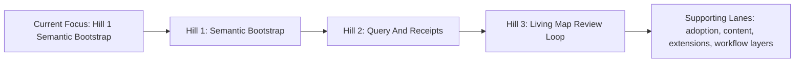

# ROADMAP

> Git Mind should point at a repository and help explain what matters, how it connects, and how it evolved.

This roadmap resets Git Mind around that core hill.

It does not erase the capabilities already built in this repository.
It reinterprets them as substrate and enabling assets rather than as a complete product story.

---

## Current Posture

Git Mind already has meaningful graph capabilities:

- graph storage on Git/WARP
- typed relationships
- query and inspection commands
- views and lenses
- semantic diff and time-travel
- suggestion and review flows
- content-on-node
- extension/runtime machinery

What it does **not** yet prove is the strongest remaining product promise:

- low-input semantic bootstrap for an unfamiliar repository
- provenance-backed answers to high-value repository questions
- a living semantic map that stays useful without becoming a hand-maintained wiki

That is what the roadmap now optimizes for.

---

## Planning Principles

1. Low-input usefulness before ontology sprawl.
2. Inference before heavy manual curation.
3. Provenance must support real answers, not just architectural purity.
4. Review should refine the map, not build it from scratch.
5. Existing graph features should be reused as leverage, not treated as the product hill themselves.
6. If a planning artifact does not improve repository understanding, question it.

---

## Operating Model

Git Mind now uses:

- IBM Hills to define the strategic outcomes
- Playbacks to assess whether recent work actually moved a Hill
- GitHub issues to track concrete implementation work
- the design-to-test delivery cycle in [ADR-0006](docs/adr/ADR-0006.md) to move work from design acceptance criteria into implementation

This is not an informal preference.
It is the repository's official planning model per [ADR-0005](docs/adr/ADR-0005.md).

GitHub milestones are intentionally not the primary planning surface anymore.
The old milestone layer had drifted into theater: completed relics staying open while the real backlog lived elsewhere.

This document should answer:

- what hill are we trying to climb?
- what evidence would prove progress?
- what work lanes support that hill?

GitHub should answer:

- what concrete work items exist right now?

Current GitHub planning labels:

- `hill:h1-bootstrap`
- `hill:h2-query-receipts`
- `hill:h3-living-map`
- `lane:foundation`
- `lane:content`
- `lane:extensions`
- `lane:packaging`
- `lane:ux`

## Planning Gate

Before significant work is accepted into an active Hill or supporting lane, we should be able to answer:

1. Which sponsor user does this help?
2. Which job to be done does it improve?
3. Which Hill does it move, or which supporting lane does it strengthen?
4. What playback evidence would show that this work actually helped?

If those answers are fuzzy, the work is not ready for planning commitment yet.

## Execution Cycle

Substantial delivery work should follow the repository's canonical cycle from [ADR-0006](docs/adr/ADR-0006.md):

1. write or revise the design artifact
2. turn acceptance criteria into failing tests
3. use canonical repo fixtures where repository-shaped behavior is under test
4. implement until the tests are green
5. run a playback / retrospective
6. update `README.md` if shipped reality changed
7. land the PR and capture review learnings back into the backlog

The first Hill 1 implementation cycles should explicitly invest in the testing substrate needed to make bootstrap behavior executable and trustworthy.

## Current Focus: Hill 1 Semantic Bootstrap

Status:

- in progress

Sponsor user:

- technical lead / staff engineer / architect, or autonomous coding agent, entering an unfamiliar repository

Job to be done:

- quickly produce a trustworthy first-pass semantic map of repository artifacts with minimal manual input

Goal:

- deliver the first runnable `git mind bootstrap` flow for unfamiliar repositories

Deliverables:

- bootstrap command contract with default write behavior and `--dry-run`
- canonical repo fixture substrate for repository-shaped bootstrap scenarios (issue [#311](https://github.com/flyingrobots/git-mind/issues/311))
- repo-local artifact inventory and scan boundaries
- first-pass entity extraction for files, docs, ADRs, modules, commits, and repo-local issue/PR references
- first-pass relationship inference for `documents`, `references`, `touches`, `groups`, and conservative `implements`
- provenance and confidence surfacing for inferred assertions
- a reviewable follow-up path for weak-confidence bootstrap output
- acceptance criteria translated into failing executable tests (issue [#310](https://github.com/flyingrobots/git-mind/issues/310))
- implementation issues `#304` through `#307`, plus enabling test issues [#310](https://github.com/flyingrobots/git-mind/issues/310) and [#311](https://github.com/flyingrobots/git-mind/issues/311), moved into merged runnable behavior

Exit criteria:

- `git mind bootstrap` runs end-to-end on a representative unfamiliar repository
- the command emits useful human-readable and JSON summary output
- inferred assertions carry provenance and confidence
- weak-confidence inferences are visible and reviewable
- day-one value appears before the user has to hand-author the graph

Primary references:

- [docs/design/git-mind.md](docs/design/git-mind.md)
- [docs/design/h1-semantic-bootstrap.md](docs/design/h1-semantic-bootstrap.md)
- [docs/design/repo-fixture-strategy.md](docs/design/repo-fixture-strategy.md)
- issue [#303](https://github.com/flyingrobots/git-mind/issues/303)
- issues [#304](https://github.com/flyingrobots/git-mind/issues/304), [#305](https://github.com/flyingrobots/git-mind/issues/305), [#306](https://github.com/flyingrobots/git-mind/issues/306), [#307](https://github.com/flyingrobots/git-mind/issues/307), [#310](https://github.com/flyingrobots/git-mind/issues/310), and [#311](https://github.com/flyingrobots/git-mind/issues/311)

---

## Hill Map

---

## Hill 1: Semantic Bootstrap

Goal:

- make Git Mind useful on day one for an unfamiliar repository with low setup and low manual input

Primary hill:

- point at a repo and get an immediately useful semantic map

Deliverables:

- defined bootstrap ingress model for the first artifact set
- initial artifact ingestion from repo-local sources
- first-pass entity extraction
- first-pass relationship inference
- confidence and provenance model for inferred associations
- one or more commands or flows that produce a useful bootstrap result

Suggested first artifact set:

- code files and module/package structure
- markdown docs
- ADRs
- commit history
- issue, PR, and commit references discoverable from repo artifacts

Playback:

- on an unfamiliar repository, Git Mind produces a first semantic map without asking the user to manually build one
- the result is incomplete but useful
- the user can see why a relationship was suggested

Exit criteria:

- the bootstrap produces value before the user feels like they are doing graph data entry
- provenance and confidence are visible enough to support trust

---

## Hill 2: Query And Receipts

Goal:

- let humans and agents ask high-value repository questions and get provenance-backed answers

Primary hill:

- repository archaeology becomes a query with receipts

Deliverables:

- defined top question set for unfamiliar repos
- query surfaces oriented around those questions
- answer payloads with provenance and confidence
- historical comparison where it materially improves answers
- machine-readable contracts that agents can consume reliably

Candidate day-one questions:

- what implements this spec?
- what ADR explains this module?
- what changed semantically in this area?
- what is weakly connected or missing?
- what tasks, reviews, or issues shaped this path?

Exit criteria:

- Git Mind can answer a small set of real repository questions better than grep plus memory
- answers are inspectable rather than magical

---

## Hill 3: Living Map Review Loop

Goal:

- keep the semantic map alive as the repository changes without turning maintenance into a second job

Primary hill:

- the map evolves with the repo instead of decaying beside it

Deliverables:

- update ingestion over new commits and artifact changes
- suggested semantic deltas
- review and refinement loop for inferred associations
- semantic drift detection or confidence decay where appropriate
- measures of map freshness and weak spots

Playback:

- new changes produce reviewable semantic updates
- maintainers refine the map when needed, but do not rebuild it by hand

Exit criteria:

- upkeep cost remains low
- semantic quality improves over time instead of flattening into noise

---

## Supporting Lanes

These lanes should support the active Hill, not replace it as the product center:

- platform hardening and contracts
- packaging and install ergonomics
- content and content UX
- extension/runtime ergonomics
- workflow adoption layers
- richer workflow-specific views
- trust-aware surfaces

Examples of work that may live here:

- graph-backed authored content where it clearly improves repo workflows
- materialized outputs
- multi-repo expansion
- operational hardening for agent-facing use
- adoption polish once zero-input repo understanding is real

Exit criteria:

- each added layer measurably improves real repository understanding or operational use
- Git Mind still does not feel like a hand-maintained wiki or ontology project

## Playback Cadence

Use playbacks to judge progress against the Hills.

Good playback questions:

1. Did recent work improve zero-input repository understanding?
2. Did it make provenance-backed answers more useful or more trustworthy?
3. Did it reduce upkeep cost instead of pushing more manual curation onto the user?
4. Did it strengthen an active supporting lane without stealing focus from the Hill?
5. If this work landed, would a new user or agent feel more capable in an unfamiliar repo?

Recommended rhythm:

- use issues and PRs for day-to-day work
- use periodic playbacks to review movement against the active Hill
- update this roadmap and `docs/design/git-mind.md` when the product frame changes
- avoid reopening milestone theater unless there is a real release-management need

---

## What Stops Work

Work should pause and be questioned if:

- setup gets heavier while first-use value stays flat
- inference remains too weak to be useful
- provenance is invisible to users
- the system requires too much manual graph building
- the product starts drifting back into personal cognition or generic PKM

---

## Decision Rule

When a tradeoff is unclear, prefer the option that increases low-input repository understanding and provenance-backed answers, even if it delays broader platform ambitions.
