# TECHNICAL TEARDOWN: git-mind

## Table of Contents

1. [Orientation and domain context](#orientation-and-domain-context)
   - [Project framing and mental model](#project-framing-and-mental-model)
   - [Domain Dictionary](#domain-dictionary)
   - [Quick architecture overview](#quick-architecture-overview)
2. [Command execution and runtime lifecycle](#command-execution-and-runtime-lifecycle)
   - [Entry point and dispatch path](#entry-point-and-dispatch-path)
   - [Bootstrapping vs runtime](#bootstrapping-vs-runtime)
   - [Golden path: initialize, mutate, and inspect nodes](#golden-path-initialize-mutate-and-inspect-nodes)
   - [Golden path: diff and doctor review](#golden-path-diff-and-doctor-review)
3. [Data model and processing pipeline](#data-model-and-processing-pipeline)
   - [Source of truth and state locations](#source-of-truth-and-state-locations)
   - [Payload anatomy and data schema](#payload-anatomy-and-data-schema)
   - [Component deep dive](#component-deep-dive)
4. [Reliability, integration, and operations](#reliability-integration-and-operations)
   - [Concurrency and asynchronous behavior](#concurrency-and-asynchronous-behavior)
   - [External dependencies and boundaries](#external-dependencies-and-boundaries)
   - [Security boundaries and auth flow](#security-boundaries-and-auth-flow)
   - [Unhappy paths and error handling](#unhappy-paths-and-error-handling)
   - [Configuration and env tuning](#configuration-and-env-tuning)
   - [Trade-offs and design rationale](#trade-offs-and-design-rationale)
5. [Outcomes and practical use](#outcomes-and-practical-use)
   - [Where this project stands](#where-this-project-stands)
   - [Future directions](#future-directions)
   - [Use cases](#use-cases)
   - [Summary of key features and design decisions](#summary-of-key-features-and-design-decisions)

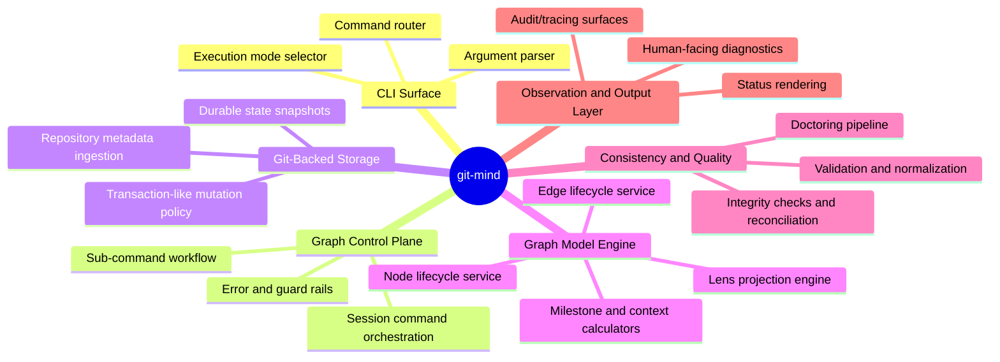

# Orientation and domain context

## Project framing and mental model

`git-mind` is a CLI-first knowledge-graph system built around repository context and Git-backed persistence. The key idea is simple to state but powerful in behavior: encode workflow semantics (tasks, milestones, blockers, traceability links) as nodes and edges in a durable graph tied to Git history.

At a high level, the project follows a three-layer mental model:

The entry layer receives command text from the terminal and selects a handler. The domain layer enforces semantic rules and query composition. The persistence layer resolves to `@git-stunts/git-warp`, which gives Git-native identity and time-aware storage.

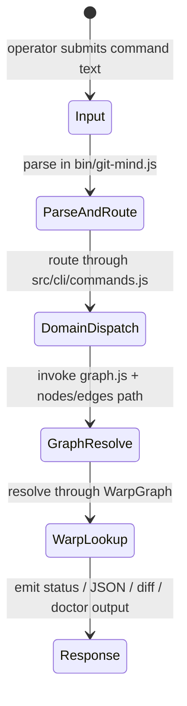


## Domain Dictionary

| Term | Definition | Related Section |
| --- | --- | --- |
| Command route | Switch-style dispatch in `bin/git-mind.js` that routes a command verb and optional flags to concrete functions in `src/cli/commands.js`. | [Entry point and dispatch path](#entry-point-and-dispatch-path) |
| Warp graph | Git-backed graph runtime from `@git-stunts/git-warp`. It is the system's durable structure store. | [Source of truth and state locations](#source-of-truth-and-state-locations) |
| Node | A typed object in the graph representing an entity like `task`, `epoch`, `review`, etc. | [Payload anatomy and data schema](#payload-anatomy-and-data-schema) |
| Edge | Directed relationship between nodes, used to express dependencies, status lineage, or containment. | [Payload anatomy and data schema](#payload-anatomy-and-data-schema) |
| Context envelope | A normalised payload envelope that carries scope, git reference, and metadata. | [Payload anatomy and data schema](#payload-anatomy-and-data-schema) |
| Epoch | Commit-anchored node id (`epoch:<sha12>`) used for time-grounded queries. | [Golden path: diff and doctor review](#golden-path-diff-and-doctor-review) |
| Lens | A reusable filtering predicate composition mechanism used when building views. | [Component deep dive](#component-deep-dive) |
| View | Named projection over nodes/edges used to produce human-readable outputs. | [Component deep dive](#component-deep-dive) |
| Doctor | Integrity-checking pass that identifies low-confidence or dangling relationships and may repair them. | [Unhappy paths and error handling](#unhappy-paths-and-error-handling) |
| Extension manifest | YAML/JSON manifest used to load optional extension definitions with schema validation. | [External dependencies and boundaries](#external-dependencies-and-boundaries) |

## Quick architecture overview

`git-mind` has a compact architecture with heavy use of explicit module boundaries.

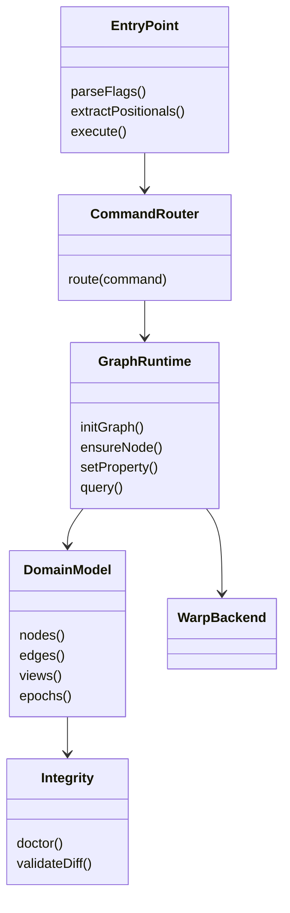

# Command execution and runtime lifecycle

## Entry point and dispatch path

The execution starts exactly at `bin/git-mind.js`. The file does parsing and dispatch, not heavy domain work.

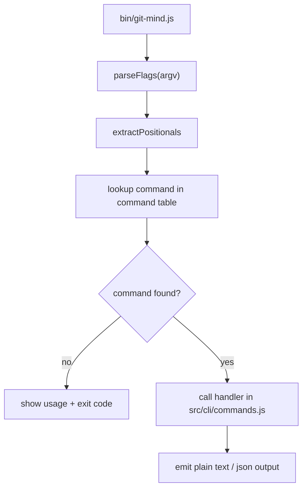

Because dispatch is centralized, all command-specific behavior stays in the same command layer. That gives developers one canonical place to inspect for side effects.

## Bootstrapping vs runtime

Bootstrapping in `git-mind` is about process validity and handler selection. Runtime is where the graph is opened, state is read/written, and results are rendered.

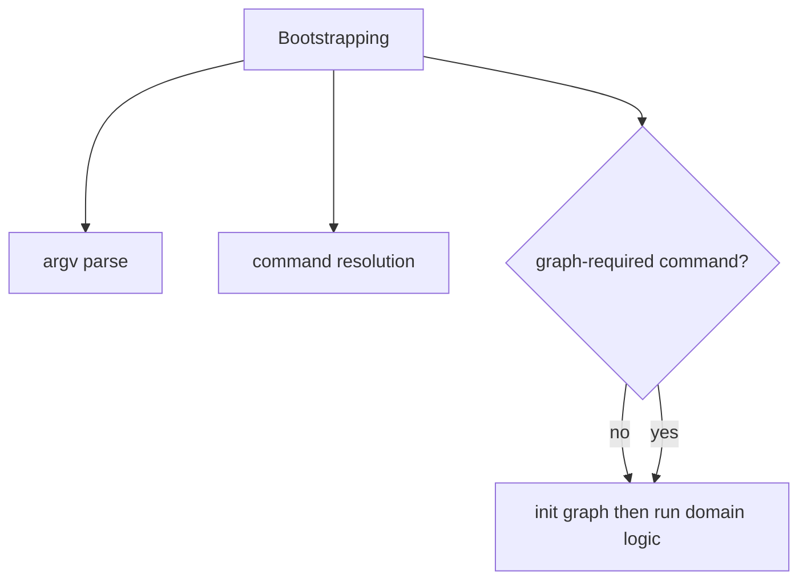

The deliberate separation reduces command parsing complexity for most operations and keeps graph bootstrap operations near where they are needed.

## Golden path: initialize, mutate, and inspect nodes

A successful path for a typical node update looks like this:

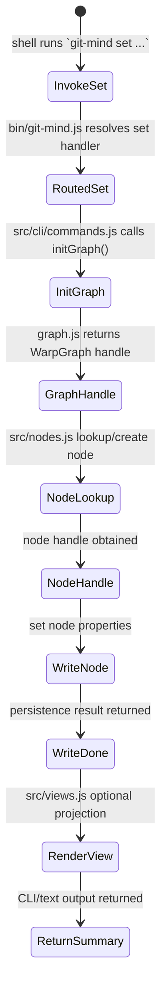

The interesting detail is that domain validation and normalization happen in this flow before property writes. Data writes are not blind assignments; they are contextualized by node shape and reference context.

## Golden path: diff and doctor review

`git-mind diff` follows a similar dispatch-to-graph path but adds fallback and integrity semantics.

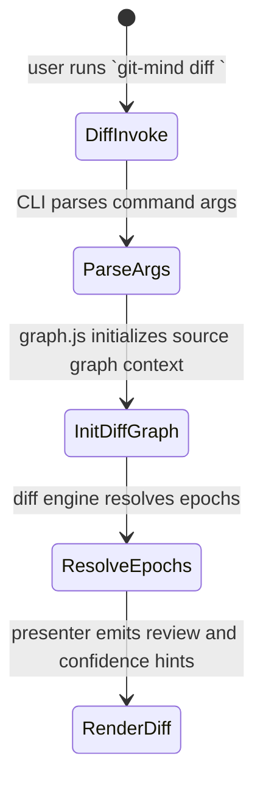

When exact epoch mapping is unavailable, the system attempts nearest-ancestor mapping so the command remains useful under partial metadata conditions.

# Data model and processing pipeline

## Source of truth and state locations

The authoritative state is the graph in the Git-backed warp layer.

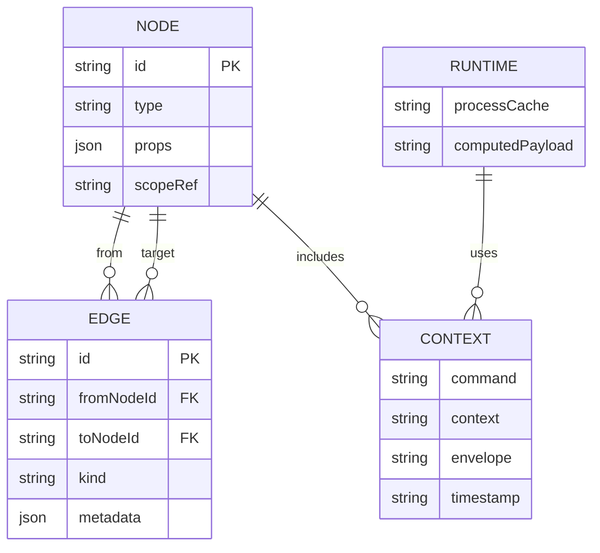

At runtime, there may be temporary in-memory payloads built for rendering and validation, but only writes to graph are durable. That split makes failure semantics clearer: if a command crashes after validation, in-memory context is lost; graph remains consistent.

## Payload anatomy and data schema

A payload entering and leaving `set` or `view` logic can be thought of as an envelope that moves from CLI parsing into normalized form.

```json
{
  "contextEnvelope": {
    "id": "node:task.onboarding.frontend",
    "ref": {
      "gitRef": "refs/heads/main",
      "commit": "9f8a4e12c3ab",
      "epoch": "epoch:9f8a4e12c3ab"
    },
    "scope": {
      "project": "acme-app",
      "labels": ["sprint", "release"],
      "visibility": "local"
    },
    "payload": {
      "status": "in-progress",
      "owner": "devops-team",
      "goal": "Onboarding checklist"
    },
    "meta": {
      "createdBy": "cli",
      "createdAt": "2026-05-31T10:00:00Z"
    }
  }
}
```

This normalization is what allows generic handlers to process commands with different verbs while preserving comparable validation and audit behavior.

## Component deep dive

`graph.js` owns graph initialization with Git adapters and crypto helpers, making all other modules graph-agnostic.

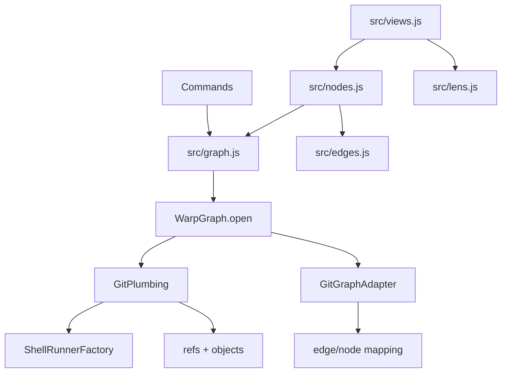

`nodes.js` and `edges.js` are the low-level mutation layer. `lens.js` and `views.js` are mid-level composition layers. `lens` lets a query remain reusable, while view names encode intention (e.g. `progress`, `coverage`, `milestone`, `onboarding`).

`epoch.js` is a temporal bridge: it maps Git commit references to epoch nodes and performs fallback logic.

`extension.js` is policy boundary logic. It loads manifests, validates them, and prevents malformed extension definitions from contaminating command execution.

`doctor.js` is the integrity boundary. It can produce recommendations and confidence diagnostics that are meant to be human-review-first, not just machine-check-only.

# Reliability, integration, and operations

## Concurrency and asynchronous behavior

`git-mind` is mostly synchronous command execution from the user’s perspective, with async I/O for filesystem and git object interactions. Concurrency is intentionally low at runtime because command semantics depend heavily on transactional order of updates and deterministic error handling.

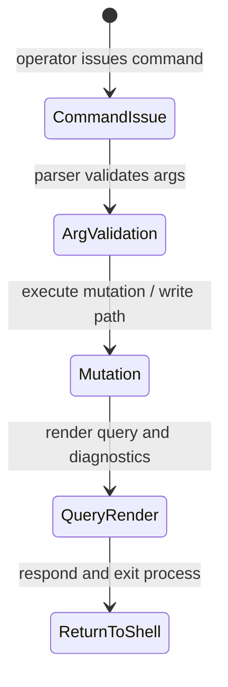


This design avoids concurrent command races on the same graph state inside one process and keeps debugging straightforward. The trade-off is lower throughput for parallel batch operations.

## External dependencies and boundaries

The boundary is clear: `git-mind` does graph orchestration and delegates cross-process concerns to Git and filesystem primitives via the warp adapters.

- `@git-stunts/git-warp`: core runtime graph.
- `GitPlumbing`, `GitGraphAdapter`: adapters over repo objects and refs.
- Node standard modules and YAML/JSON parsers for extension manifest and I/O utilities.

Any code outside these modules cannot mutate graph directly unless it goes through command handlers.

## Security boundaries and auth flow

`git-mind` does not implement OAuth/JWT/session tokens. Auth and trust flow comes from repository permissions and process identity.

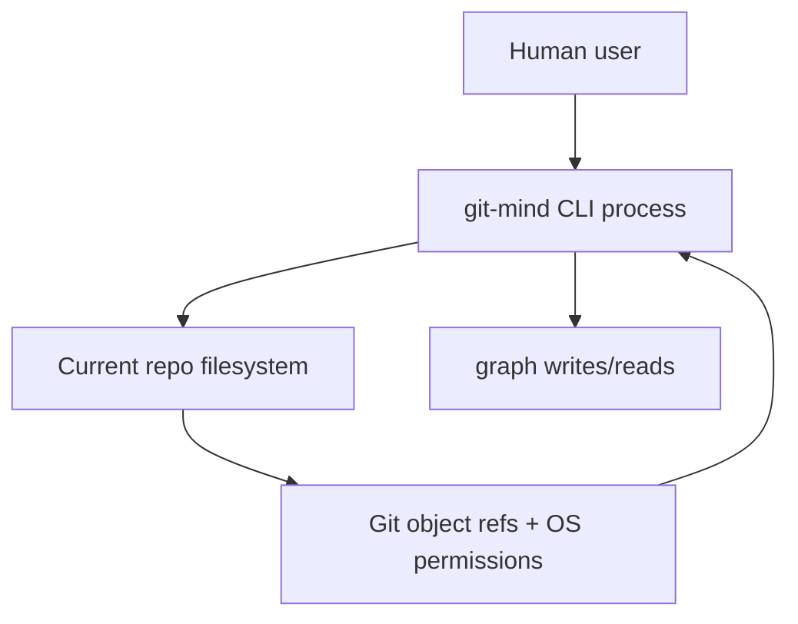

In practical terms, if the user cannot read/write repo objects, the graph open phase fails and command handling returns actionable errors.

## Unhappy paths and error handling

There is explicit handling for invalid commands, malformed payloads, unresolved manifests, and graph integrity issues.

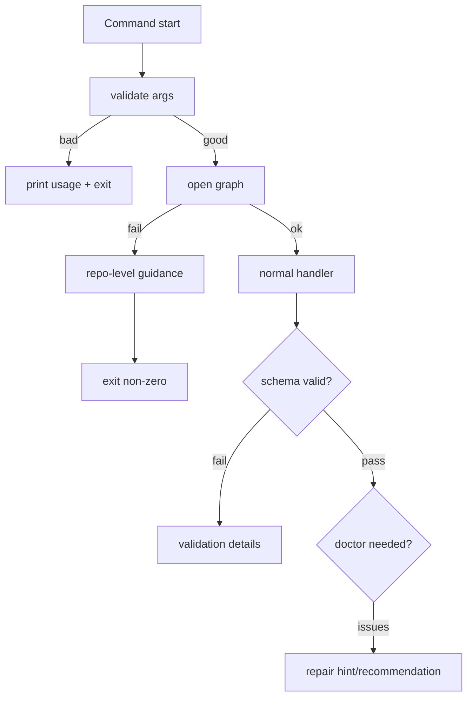

`doctor` paths are a good example of failure handling philosophy: instead of hard-failing on every consistency issue, `git-mind` often degrades to warnings and explicit guidance.

## Configuration and env tuning

Most behavior is driven by command flags and repository state, not by many global environment variables.

There are still a few environment-level levers worth knowing because they significantly shift runtime behavior.

`GITMIND_AGENT` can override the external suggestion command used by `git-mind suggest` and is required when the command is run without `--agent`.

`GITMIND_DEBUG` enables debug-oriented output, including timing details in diff rendering paths.

Because these knobs are explicit process-level controls, teams can keep command behavior reproducible by documenting the exact environment used for each workflow.

This means there are fewer hidden knobs and more discoverable behavior from `--help`. In practice, this reduces configuration drift in team environments.

## Trade-offs and design rationale

One important design choice is explicit graph ownership by the CLI. A thin executable layer plus deep domain modules gives strong debuggability and stable extension points.

- Choosing warp-first storage gives portability and traceability with Git, but couples behavior to repo lifecycle.
- Choosing strict command dispatch centralization simplifies onboarding new commands but creates a larger command hub.
- Choosing context envelopes reduces accidental schema drift at write time but adds ceremony for simple one-off writes.

`git-mind` favors correctness and repeatable execution over ultra-low-latency throughput.

# Outcomes and practical use

## Where this project stands

The repo includes a practical command surface, persistent graph primitives, integrity diagnostics, and a meaningful extension architecture. The architecture appears stable enough for heavy local use and for scriptable workflows.

Given docs and feature breadth, it is beyond a prototype stage. The system has explicit domain abstractions and maintenance tools for evolving semantics.

## Future directions

Likely evolution work includes stronger migration tooling around graph schema versions, richer extension lifecycle management, and richer diagnostics automation so recurring `doctor` warnings can be auto-batched.

The core contract will likely remain: typed graph semantics over Git-backed persistence.

## Use cases

1. Engineers need structured checkpointing of project artifacts (tasks, milestones, blockers) inside the repo history.
2. Teams want command-driven audits of task progression and missed dependencies.
3. A developer wants to quickly open a view for onboarding status across multiple nodes.
4. A reviewer wants temporal diffing between two commit-based epochs.
5. Repo maintainers need a non-networked, local source of truth for workflow metadata.
6. Automation scripts need deterministic graph operations for repeatable pipelines.
7. Teams want extension loading for local vocabulary without modifying core behavior.
8. A project lead wants doctor-style consistency checks before release.
9. Researchers need reproducible context snapshots for experiments tied to commit lineage.
10. Governance teams need low-noise traceability of who changed task state and where.

## Summary of key features and design decisions

Key features are: command-centric workflow, Git-backed graph operations, epoch-based temporal mapping, view/lens abstraction, integrity and repair checks, and manifest validation.

Most notable design decision: keep execution entry very small and route all meaningful work to a domain module stack. This yields understandable execution traces and cleaner evolution of command semantics.

The design trade-off is deliberate: low ambiguity for local durability and reproducibility at the cost of centralized operational throughput.
