# Git Mind Technical Teardown

This document explains Git Mind from zero. It starts at the executable entry
point, then gradually opens the system layer by layer: command dispatch,
Git-backed graph storage, data validation, views, historical reads, AI
suggestions, review decisions, extensions, and the current product direction.

The reader is assumed to know nothing about Git Mind, WARP, or the repository
intelligence domain.

## Table Of Contents

1. [System Overview Mind Map](#system-overview-mind-map)
2. [Domain Dictionary](#domain-dictionary)
3. [Where This Project Stands](#where-this-project-stands)
4. [The Exact Entry Point](#the-exact-entry-point)
5. [Bootstrapping Versus Runtime](#bootstrapping-versus-runtime)
6. [Architecture At A Glance](#architecture-at-a-glance)
7. [The Graph Data Model](#the-graph-data-model)
8. [Source Of Truth](#source-of-truth)
9. [Golden Path One: `git mind init`](#golden-path-one-git-mind-init)
10. [Golden Path Two: `git mind link`](#golden-path-two-git-mind-link)
11. [Golden Path Three: Import And Export](#golden-path-three-import-and-export)
12. [Golden Path Four: Views And Lenses](#golden-path-four-views-and-lenses)
13. [Golden Path Five: Time Travel And Semantic Diff](#golden-path-five-time-travel-and-semantic-diff)
14. [Golden Path Six: Suggestions And Review](#golden-path-six-suggestions-and-review)
15. [Golden Path Seven: Content On Node](#golden-path-seven-content-on-node)
16. [Golden Path Eight: Extensions](#golden-path-eight-extensions)
17. [Golden Path Nine: Cross-Repository Merge](#golden-path-nine-cross-repository-merge)
18. [Unhappy Paths And Error Handling](#unhappy-paths-and-error-handling)
19. [Concurrency And Async Behavior](#concurrency-and-async-behavior)
20. [External Dependencies And Borders](#external-dependencies-and-borders)
21. [Security Boundaries And Trust](#security-boundaries-and-trust)
22. [Configuration And Environment Tuning](#configuration-and-environment-tuning)
23. [Why It Is Built This Way](#why-it-is-built-this-way)
24. [Ten Use Cases](#ten-use-cases)
25. [Future Directions](#future-directions)
26. [Key Features And Design Decisions](#key-features-and-design-decisions)

## System Overview Mind Map

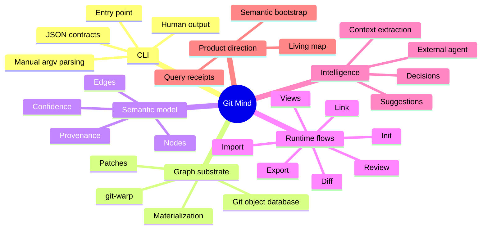
```mermaid
mindmap
  root((Git Mind))
    CLI
      Entry point
      Manual argv parsing
      Human output
      JSON contracts
    Graph substrate
      git-warp
      Git object database
      Patches
      Materialization
    Semantic model
      Nodes
      Edges
      Confidence
      Provenance
    Runtime flows
      Init
      Link
      Import
      Export
      Views
      Diff
      Review
    Intelligence
      Context extraction
      External agent
      Suggestions
      Decisions
    Product direction
      Semantic bootstrap
      Query receipts
      Living map
```

## Domain Dictionary

| Term | Definition |
|------|------------|
| [Git Mind](#where-this-project-stands) | CLI and library for recording repository meaning in Git. |
| [Semantic graph](#the-graph-data-model) | Directed graph of repository facts. |
| [Node](#canonical-nodes) | Named repository thing, such as `file:src/graph.js` or `issue:322`. |
| [Edge](#canonical-edges) | Directed typed relationship between two nodes. |
| [Assertion](#assertion-identity) | Graph fact identified by `(source, target, type)`. |
| [WARP](#graph-storage-with-warp) | Git-backed CRDT graph substrate from `@git-stunts/git-warp`. |
| [Patch](#patch-based-writes) | Batch of graph mutations committed atomically to WARP. |
| [Materialization](#materialization-and-compatibility) | Replay of WARP state into a readable snapshot. |
| [Context envelope](#context-resolution) | Immutable read context for ref, observer, trust, and extension lock. |
| [Observer](#observers-and-trust-context) | Graph-stored read filter addressed as `observer:<name>`. |
| [View](#views) | Named graph projection, such as `architecture` or `progress`. |
| [Lens](#lenses) | Post-processing filter composed onto a view. |
| [Epoch](#epochs) | System node mapping a Git commit SHA to a WARP Lamport tick. |
| [Decision node](#review-decisions) | `decision:` node recording review action for a low-confidence assertion. |
| [Content on node](#golden-path-seven-content-on-node) | Rich content attached to a graph node through WARP storage. |
| [Extension](#golden-path-eight-extensions) | Manifest declaring prefixes, views, rules, adapters, or materializers. |
| [Cross-repo ID](#cross-repository-ids) | Qualified node ID: `repo:owner/name:prefix:identifier`. |

## Where This Project Stands

Git Mind is currently a mature graph substrate and an evolving repository
intelligence product. The package is version `5.0.0`, runs on Node.js 22 or
newer, and stores semantic graph state in Git through `@git-stunts/git-warp`
17.0.0 and `@git-stunts/plumbing` 3.0.3.

The shipped runtime already supports graph initialization, typed links, node
properties, YAML import, Markdown frontmatter import, export, status summaries,
views, lenses, time-travel reads, semantic diffs, content attached to nodes,
extension manifests, cross-repository graph merge, AI-assisted suggestions, and
review decisions.

The product is not yet finished. The stated current hill is Hill 1: zero-input
semantic bootstrap. That means the project is trying to move from a powerful
manual and semi-automated graph substrate toward a tool that can be pointed at an
unfamiliar repository and produce a useful first semantic map without requiring
the user to hand-author the graph.

The distinction matters. The code can already store, inspect, filter, and diff
semantic knowledge. The planned product move is to make the first useful graph
appear from repository artifacts themselves: code files, docs, ADRs, commit
history, issue references, PR references, and eventually review artifacts. The
CLI now exposes the first `git mind bootstrap` command contract, but the
repository scanner and inference pipeline are still planned follow-up slices.

## The Exact Entry Point

Execution starts in [bin/git-mind.js](bin/git-mind.js). This is the file listed
under the `bin` field in `package.json`, so when a user runs `git mind ...` or
`git-mind ...`, Node executes this script.

The entry point is an ES module with top-level `await`. There is no framework,
command router package, web server, dependency injection container, or generated
CLI layer. The script reads `process.argv`, identifies the command, manually
parses flags, calls an exported command function from `src/cli/commands.js`, and
then flushes stdout and stderr before exiting.

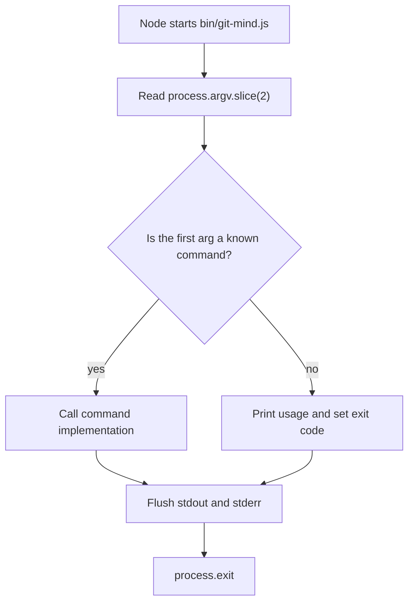
```mermaid
flowchart TD
    Start["Node starts bin/git-mind.js"]
    Args["Read process.argv.slice(2)"]
    Command{"Is the first arg a known command?"}
    Dispatch["Call command implementation"]
    Usage["Print usage and set exit code"]
    Flush["Flush stdout and stderr"]
    Exit["process.exit"]

    Start --> Args
    Args --> Command
    Command -->|yes| Dispatch
    Command -->|no| Usage
    Dispatch --> Flush
    Usage --> Flush
    Flush --> Exit
```

The entry point deliberately keeps parsing simple. `parseFlags()` understands
`--flag value` pairs and a small set of boolean flags such as `--json`,
`--fix`, `--dry-run`, `--validate`, and `--raw`. `extractPositionals()` walks the
same argument array and returns only the non-flag arguments. This is not as rich
as a CLI framework, but the trade-off is excellent local clarity: every command's
shape is visible in one switch statement.

### Entry Payload

At process start, the only payload is the operating system argument vector. For
example, this user command:

```bash
git mind link file:src/graph.js spec:graph-schema --type implements --confidence 0.9
```

arrives in the entry point like this:

```json
{
  "process.argv.slice(2)": [
    "link",
    "file:src/graph.js",
    "spec:graph-schema",
    "--type",
    "implements",
    "--confidence",
    "0.9"
  ],
  "command": "link",
  "cwd": "/path/to/repository"
}
```

The source of truth at this point is not the graph. It is the running process:
the argument array, the current working directory, and the environment. No graph
state has been opened yet.

## Bootstrapping Versus Runtime

Git Mind has two meanings of bootstrapping, and they should not be confused.

Program bootstrapping is what `bin/git-mind.js` does every time it starts. It
imports modules, parses arguments, constructs context objects when needed, and
dispatches one command.

Product bootstrapping is the Hill 1 feature surfaced as `git mind bootstrap`.
The current executable command establishes the JSON and dry-run contract. Later
slices will fill that contract by scanning an unfamiliar repository and inferring
a first semantic map.

Runtime begins after command dispatch. At runtime, each command decides whether
it needs a graph, opens that graph with `initGraph(cwd)`, performs reads or
writes, formats output, and sets `process.exitCode` on failure.

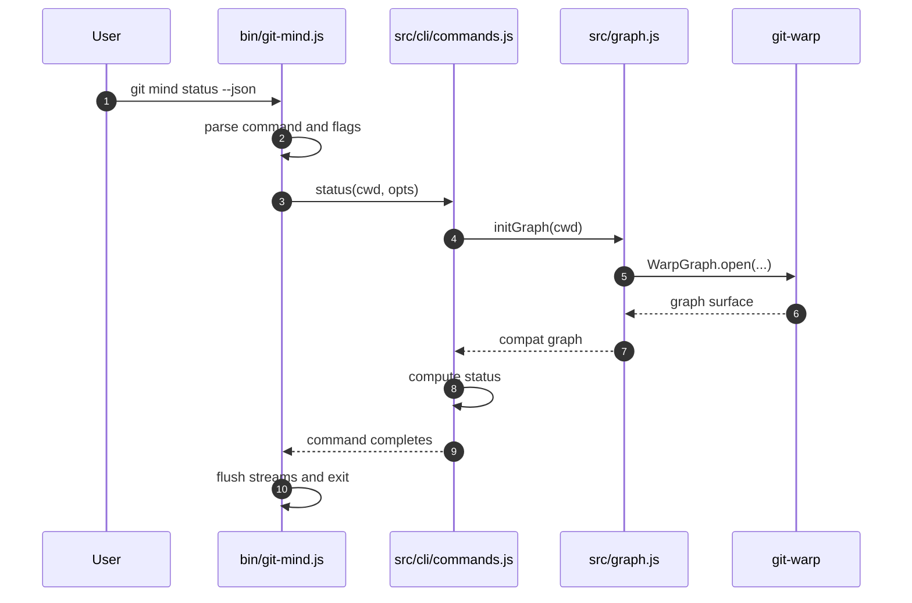
```mermaid
sequenceDiagram
    autonumber
    participant User
    participant Entry as bin/git-mind.js
    participant Commands as src/cli/commands.js
    participant Graph as src/graph.js
    participant Warp as git-warp

    User->>Entry: git mind status --json
    Entry->>Entry: parse command and flags
    Entry->>Commands: status(cwd, opts)
    Commands->>Graph: initGraph(cwd)
    Graph->>Warp: WarpGraph.open(...)
    Warp-->>Graph: graph surface
    Graph-->>Commands: compat graph
    Commands->>Commands: compute status
    Commands-->>Entry: command completes
    Entry->>Entry: flush streams and exit
```

## Architecture At A Glance

The implementation is a local-first CLI and library. The CLI layer owns command
syntax and output contracts. The domain modules own graph operations. The graph
module owns the compatibility boundary between Git Mind and `git-warp`.

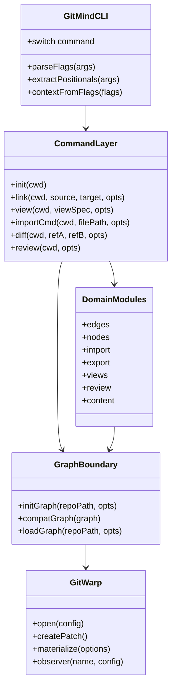
```mermaid
classDiagram
    class GitMindCLI {
      +parseFlags(args)
      +extractPositionals(args)
      +contextFromFlags(flags)
      +switch command
    }

    class CommandLayer {
      +init(cwd)
      +link(cwd, source, target, opts)
      +view(cwd, viewSpec, opts)
      +importCmd(cwd, filePath, opts)
      +diff(cwd, refA, refB, opts)
      +review(cwd, opts)
    }

    class GraphBoundary {
      +initGraph(repoPath, opts)
      +compatGraph(graph)
      +loadGraph(repoPath, opts)
    }

    class GitWarp {
      +open(config)
      +createPatch()
      +materialize(options)
      +observer(name, config)
    }

    class DomainModules {
      +edges
      +nodes
      +import
      +export
      +views
      +review
      +content
    }

    GitMindCLI --> CommandLayer
    CommandLayer --> GraphBoundary
    GraphBoundary --> GitWarp
    CommandLayer --> DomainModules
    DomainModules --> GraphBoundary
```

### Component Roles

`bin/git-mind.js` exists to be boring. Its job is to keep process-level concerns
out of the domain modules. It reads arguments, handles unknown commands, converts
flags to options, and exits cleanly even when stdout is closed by a pipe.

`src/cli/commands.js` is the CLI service layer. It catches errors, opens graphs,
calls domain functions, and chooses human or JSON formatting. It is also the
boundary where `ContextEnvelope` objects are resolved into real graph surfaces.

`src/graph.js` is the most important integration seam. Git Mind depends on a
small graph surface, while `git-warp` has evolved across major versions. The
compatibility wrapper preserves the v14-shaped methods Git Mind expects while
using the v17 app/core/query/patch surfaces underneath.

The domain modules are deliberately small. `edges.js` creates and removes
relationships. `nodes.js` inspects and mutates node properties. `import.js` and
`frontmatter.js` ingest structured data. `export.js` writes round-trippable graph
data. `views.js`, `lens.js`, and `lenses/core.js` produce projections. `epoch.js`
connects Git history to WARP ticks. `diff.js` compares historical snapshots.
`suggest.js` shells out to an external agent. `review.js` records human review
decisions. `content.js` attaches blobs to nodes. `extension.js` loads manifests.
`merge.js` qualifies another repo's graph into the local graph.

## The Graph Data Model

Git Mind models repository meaning as directed assertions between canonical
nodes. The runtime schema is v1, and the product vocabulary is described in
`docs/design/graph-data-model.md`.

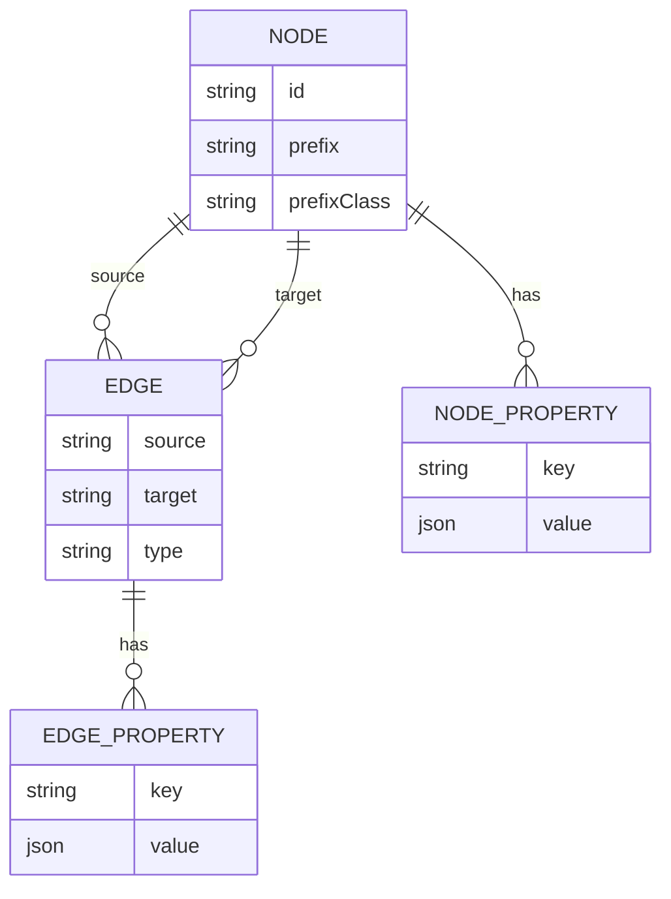
```mermaid
erDiagram
    NODE ||--o{ EDGE : "source"
    NODE ||--o{ EDGE : "target"
    NODE ||--o{ NODE_PROPERTY : "has"
    EDGE ||--o{ EDGE_PROPERTY : "has"

    NODE {
      string id
      string prefix
      string prefixClass
    }

    EDGE {
      string source
      string target
      string type
    }

    NODE_PROPERTY {
      string key
      json value
    }

    EDGE_PROPERTY {
      string key
      json value
    }
```

### Canonical Nodes

A node ID has the form `prefix:identifier`. The current validator accepts local
node IDs that match `^[a-z][a-z0-9-]*:[A-Za-z0-9._/@-]+$` and cross-repo IDs
that match `repo:owner/name:prefix:identifier`.

Canonical prefixes include planning nodes such as `issue:`, `pr:`, `task:`,
`feature:`, and `milestone:`; knowledge nodes such as `spec:`, `adr:`, `doc:`,
`concept:`, and `decision:`; architecture nodes such as `crate:`, `module:`,
`pkg:`, and `file:`; actor/tool nodes such as `person:` and `tool:`; and
observability nodes such as `event:` and `metric:`.

System prefixes include `commit:`, `repo:`, and `epoch:`. The product model says
these are owned by Git Mind system writers. In the current code, validators
classify them as system prefixes, while importer behavior is still evolving
toward the stricter product contract.

### Canonical Edges

The runtime accepts eleven edge types:

| Edge Type | Meaning |
|-----------|---------|
| `implements` | The source realizes the target. |
| `augments` | The source extends the target. |
| `relates-to` | The source is generally associated with the target. |
| `references` | The source explicitly cites or mentions the target. |
| `touches` | The source changes or affects the target. |
| `groups` | The source contains or groups the target. |
| `blocks` | The source blocks progress on the target. |
| `belongs-to` | The source is a child or member of the target. |
| `consumed-by` | The source resource is consumed by the target. |
| `depends-on` | The source depends on the target. |
| `documents` | The source explains the target. |

Direction is not decoration. A `blocks` edge points from blocker to blocked. A
`depends-on` edge points from dependent to dependency. A `documents` edge points
from explainer to subject. Views, lenses, review receipts, and semantic diffs
all depend on this direction being stable.

### Assertion Identity

Git Mind does not create first-class `edge:` nodes. An assertion is identified
by the tuple `(source, target, type)`. This tuple is used by diffing, receipts,
review decisions, import/export reasoning, and diagnostics.

```json
{
  "source": "file:src/graph.js",
  "target": "spec:graph-schema",
  "type": "implements",
  "assertionKey": [
    "file:src/graph.js",
    "spec:graph-schema",
    "implements"
  ]
}
```

The trade-off is intentional. Tuple identity keeps the graph simple and aligns
with WARP edge uniqueness. The cost is that if Git Mind later needs durable
first-class assertion objects, it will need a deliberate schema change rather
than an ad hoc `edge:` convention.

### Edge Properties

Edges carry metadata. `createEdge()` sets `confidence` and `createdAt` on every
new edge. It also sets `rationale` when the caller provides one. Review flows
later set `reviewedAt` when a suggestion is accepted or adjusted.

```json
{
  "from": "file:src/graph.js",
  "to": "spec:graph-schema",
  "label": "implements",
  "props": {
    "confidence": 0.9,
    "createdAt": "2026-06-01T05:00:00.000Z",
    "rationale": "graph.js opens the WARP graph described by the schema"
  }
}
```

## Source Of Truth

The durable source of truth is the local Git repository. Git Mind does not keep
its authoritative state in SQLite, Postgres, Redis, a hosted service, or a
daemon process. Graph state is persisted through WARP into Git objects and WARP
refs inside the repository.

In memory, Git Mind temporarily holds parsed CLI flags, `ContextEnvelope`
objects, graph snapshots, patch objects, import payloads, view results, agent
responses, and formatted output. That memory is disposable. Once the process
exits, durable graph state lives in Git.

For content-on-node, the content body is stored as a Git blob through WARP's
content API. The node stores the content object ID and content metadata as node
properties.

For time-travel reads, the source of truth is two-part. Git supplies commit
identity and ancestor walking. WARP supplies Lamport ticks and graph
materialization. Epoch nodes connect those two worlds.

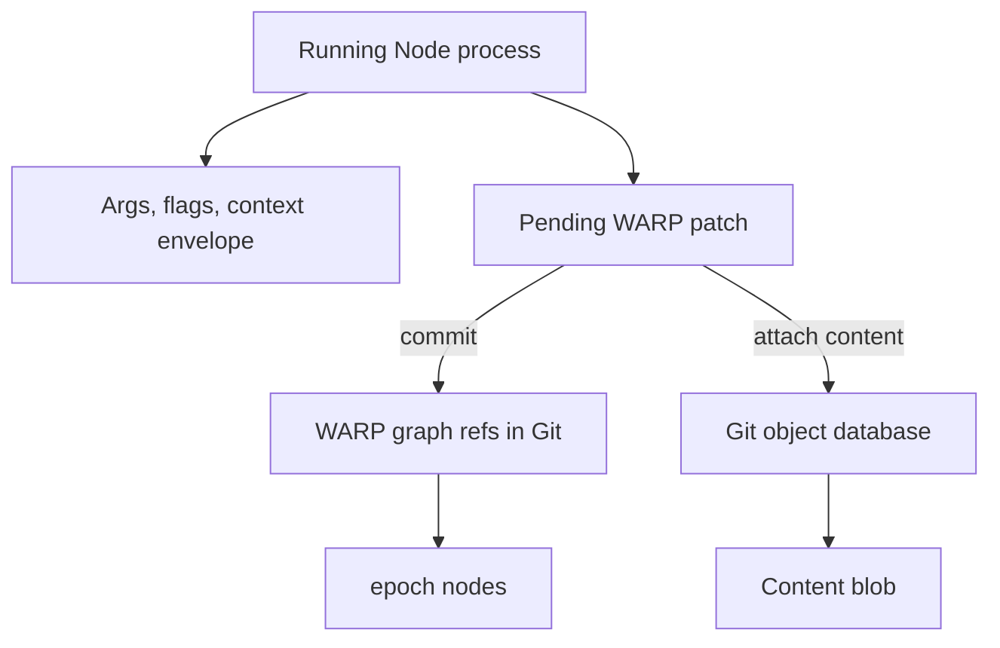
```mermaid
flowchart TD
    Process["Running Node process"]
    Args["Args, flags, context envelope"]
    Patch["Pending WARP patch"]
    GraphRefs["WARP graph refs in Git"]
    Objects["Git object database"]
    Blob["Content blob"]
    Epoch["epoch nodes"]

    Process --> Args
    Process --> Patch
    Patch -->|commit| GraphRefs
    Patch -->|attach content| Objects
    Objects --> Blob
    GraphRefs --> Epoch
```

## Golden Path One: `git mind init`

`git mind init` is the smallest successful path. The entry point dispatches to
`init(cwd)`, which calls `initGraph(cwd)`. `initGraph()` resolves the repository
path, creates Git plumbing for that directory, wraps it in a `GitGraphAdapter`,
and calls `WarpGraph.open()`.

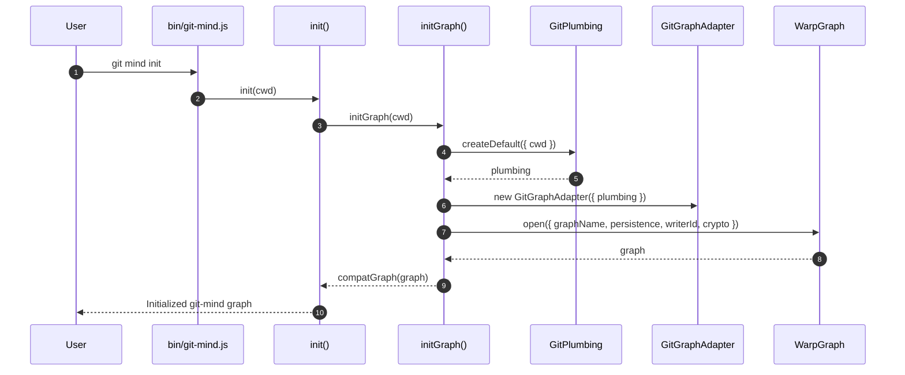
```mermaid
sequenceDiagram
    autonumber
    participant User
    participant Entry as bin/git-mind.js
    participant Commands as init()
    participant Graph as initGraph()
    participant Plumbing as GitPlumbing
    participant Adapter as GitGraphAdapter
    participant Warp as WarpGraph

    User->>Entry: git mind init
    Entry->>Commands: init(cwd)
    Commands->>Graph: initGraph(cwd)
    Graph->>Plumbing: createDefault({ cwd })
    Plumbing-->>Graph: plumbing
    Graph->>Adapter: new GitGraphAdapter({ plumbing })
    Graph->>Warp: open({ graphName, persistence, writerId, crypto })
    Warp-->>Graph: graph
    Graph-->>Commands: compatGraph(graph)
    Commands-->>User: Initialized git-mind graph
```

### Graph Storage With WARP

The graph name is hard-coded as `gitmind`. The default writer ID is `local`,
although context-sensitive reads and diffs use writer IDs such as `ctx-reader`,
`ctx-resolver`, `diff-a`, and `diff-b`.

The code creates a `NodeCryptoAdapter`, which means graph operations can use
Node-native cryptographic support through WARP. Git Mind itself does not manage
signing keys or identity tokens here; it delegates cryptographic substrate needs
to WARP.

### Materialization And Compatibility

The distinctive part of `src/graph.js` is `compatGraph()`. It adapts the current
WARP v17 surface back to the method shape Git Mind's domain modules expect. It
separates core, query, and patch surfaces, lazily materializes before reads, and
marks the local wrapper dirty after commits so later reads re-materialize.

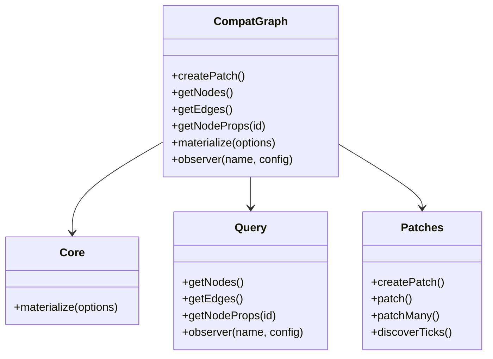
```mermaid
classDiagram
    class CompatGraph {
      +createPatch()
      +getNodes()
      +getEdges()
      +getNodeProps(id)
      +materialize(options)
      +observer(name, config)
    }

    class Core {
      +materialize(options)
    }

    class Query {
      +getNodes()
      +getEdges()
      +getNodeProps(id)
      +observer(name, config)
    }

    class Patches {
      +createPatch()
      +patch()
      +patchMany()
      +discoverTicks()
    }

    CompatGraph --> Core
    CompatGraph --> Query
    CompatGraph --> Patches
```

This is a pragmatic compatibility layer. The project trades a small adapter for
less churn across the rest of the codebase. Domain modules can keep calling
`graph.getEdges()` and `graph.createPatch()` while the adapter absorbs upstream
API movement.

## Golden Path Two: `git mind link`

`git mind link` creates one semantic assertion. It takes a source node, a target
node, an optional edge type, an optional confidence value, and an optional
remote repository qualifier.

The happy path validates the edge, creates missing endpoint nodes, adds the
edge, records edge properties, and commits one WARP patch.

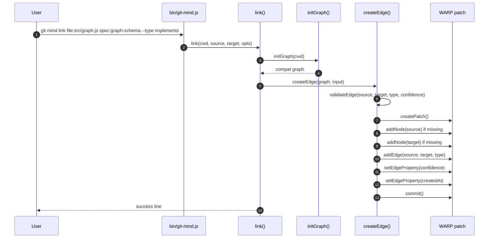
```mermaid
sequenceDiagram
    autonumber
    participant User
    participant Entry as bin/git-mind.js
    participant Commands as link()
    participant Graph as initGraph()
    participant Edges as createEdge()
    participant Patch as WARP patch

    User->>Entry: git mind link file:src/graph.js spec:graph-schema --type implements
    Entry->>Commands: link(cwd, source, target, opts)
    Commands->>Graph: initGraph(cwd)
    Graph-->>Commands: compat graph
    Commands->>Edges: createEdge(graph, input)
    Edges->>Edges: validateEdge(source, target, type, confidence)
    Edges->>Patch: createPatch()
    Edges->>Patch: addNode(source) if missing
    Edges->>Patch: addNode(target) if missing
    Edges->>Patch: addEdge(source, target, type)
    Edges->>Patch: setEdgeProperty(confidence)
    Edges->>Patch: setEdgeProperty(createdAt)
    Edges->>Patch: commit()
    Commands-->>User: success line
```

### Patch-Based Writes

The write is intentionally patch-based rather than a sequence of immediate
mutations. The patch is the unit of atomic graph change. If the patch commits,
the assertion and its properties land together. If validation fails before the
patch, nothing writes.

```json
{
  "source": "file:src/graph.js",
  "target": "spec:graph-schema",
  "type": "implements",
  "confidence": 0.9,
  "rationale": "Optional human-readable explanation"
}
```

### Cross-Repository IDs

If the user passes `--remote owner/name`, the command qualifies local node IDs
before validation. `file:src/api.js` becomes
`repo:owner/name:file:src/api.js`. This lets a local graph carry references to
another repository without pretending those nodes are local facts.

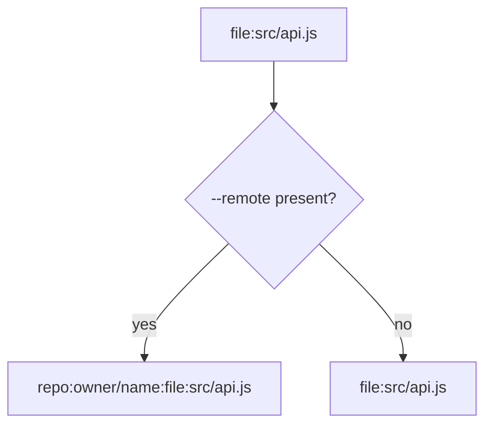
```mermaid
flowchart TD
    Local["file:src/api.js"]
    RemoteFlag{"--remote present?"}
    Qualified["repo:owner/name:file:src/api.js"]
    Unchanged["file:src/api.js"]

    Local --> RemoteFlag
    RemoteFlag -->|yes| Qualified
    RemoteFlag -->|no| Unchanged
```

## Golden Path Three: Import And Export

Git Mind has two import paths. YAML import reads an explicit v1 graph payload.
Markdown import scans Markdown files for YAML frontmatter and converts recognized
fields into the same v1 graph payload. Both paths eventually call `importData()`,
so validation and write behavior are shared.

### YAML Import Payload

```yaml
version: 1
nodes:
  - id: spec:graph-schema
    properties:
      title: Graph Schema
  - id: file:src/graph.js
edges:
  - source: file:src/graph.js
    target: spec:graph-schema
    type: implements
    confidence: 0.9
    rationale: graph.js opens and adapts the WARP graph
```

### YAML Import Sequence

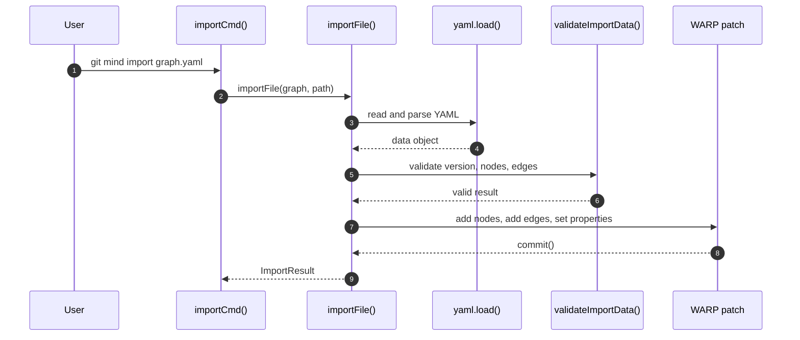
```mermaid
sequenceDiagram
    autonumber
    participant User
    participant Commands as importCmd()
    participant Import as importFile()
    participant Parser as yaml.load()
    participant Validator as validateImportData()
    participant Patch as WARP patch

    User->>Commands: git mind import graph.yaml
    Commands->>Import: importFile(graph, path)
    Import->>Parser: read and parse YAML
    Parser-->>Import: data object
    Import->>Validator: validate version, nodes, edges
    Validator-->>Import: valid result
    Import->>Patch: add nodes, add edges, set properties
    Patch-->>Import: commit()
    Import-->>Commands: ImportResult
```

Validation checks the schema version, node structure, edge structure, edge type,
confidence range, self-edge constraints for `blocks` and `depends-on`, and
whether edge endpoints are declared in the payload or already exist in the graph.
Unknown node prefixes produce warnings rather than hard failures, which keeps
the taxonomy extensible.

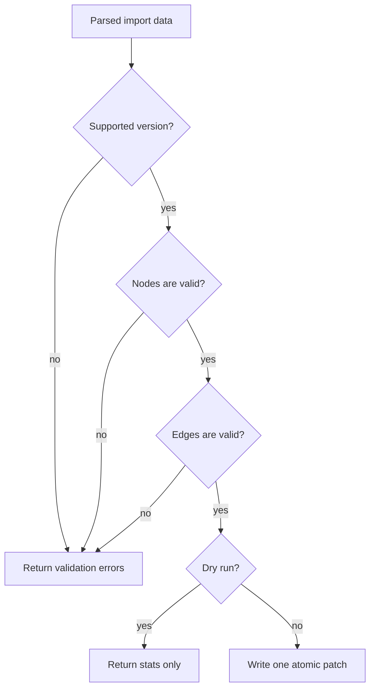
```mermaid
flowchart TD
    Data["Parsed import data"]
    Version{"Supported version?"}
    Nodes{"Nodes are valid?"}
    Edges{"Edges are valid?"}
    DryRun{"Dry run?"}
    Report["Return stats only"]
    Write["Write one atomic patch"]
    Error["Return validation errors"]

    Data --> Version
    Version -->|no| Error
    Version -->|yes| Nodes
    Nodes -->|no| Error
    Nodes -->|yes| Edges
    Edges -->|no| Error
    Edges -->|yes| DryRun
    DryRun -->|yes| Report
    DryRun -->|no| Write
```

### Markdown Frontmatter Import

Markdown import is a convenience layer over the same v1 import pipeline. The
frontmatter parser normalizes CRLF to LF, looks for a standalone opening and
closing `---`, parses the YAML block, and ignores files without usable
frontmatter.

A Markdown file like this:

```markdown
---
id: doc:graph-design
title: Graph Design
documents: spec:graph-schema
references:
  - issue:322
---

# Graph Design
```

becomes this intermediate import data:

```json
{
  "version": 1,
  "nodes": [
    {
      "id": "doc:graph-design",
      "properties": {
        "title": "Graph Design"
      }
    },
    {
      "id": "spec:graph-schema"
    },
    {
      "id": "issue:322"
    }
  ],
  "edges": [
    {
      "source": "doc:graph-design",
      "target": "spec:graph-schema",
      "type": "documents"
    },
    {
      "source": "doc:graph-design",
      "target": "issue:322",
      "type": "references"
    }
  ]
}
```

### Export

Export is the inverse path. It reads graph nodes and edges, filters out system
prefixes such as `decision`, `commit`, and `epoch`, omits system-managed edge
timestamps, and serializes a v1 import-compatible payload as YAML or JSON.

The trade-off is that export is not a forensic dump. It is a clean interchange
format designed for edit-and-import workflows. If you need full internal state,
the Git/WARP refs are the real source of truth.

## Golden Path Four: Views And Lenses

A view is a named projection over the graph. A lens is a post-processing
projection composed onto a view. The CLI syntax uses colons:

```bash
git mind view roadmap:incomplete:frontier
```

That reads as: render the `roadmap` view, then apply the `incomplete` lens, then
apply the `frontier` lens.

### Views

Views live in a registry in `src/views.js`. Some are declarative, such as
`architecture`, which is defined by prefixes and edge types. Others are
imperative, such as `blockers`, which computes transitive blocking chains and
cycle metadata.

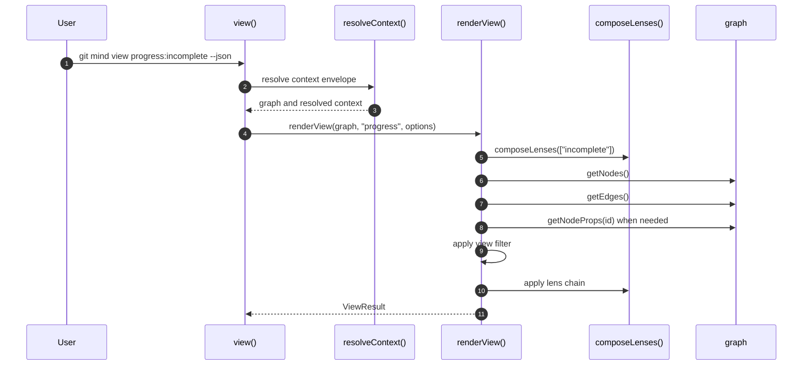
```mermaid
sequenceDiagram
    autonumber
    participant User
    participant Commands as view()
    participant Context as resolveContext()
    participant Views as renderView()
    participant Lens as composeLenses()
    participant Graph as graph

    User->>Commands: git mind view progress:incomplete --json
    Commands->>Context: resolve context envelope
    Context-->>Commands: graph and resolved context
    Commands->>Views: renderView(graph, "progress", options)
    Views->>Lens: composeLenses(["incomplete"])
    Views->>Graph: getNodes()
    Views->>Graph: getEdges()
    Views->>Graph: getNodeProps(id) when needed
    Views->>Views: apply view filter
    Views->>Lens: apply lens chain
    Views-->>Commands: ViewResult
```

### Lenses

Core lenses are registered by `src/lenses/core.js`. They are intentionally pure
transformations from `ViewResult` to `ViewResult`.

| Lens | What It Keeps | Distinctive Logic |
|------|---------------|-------------------|
| `incomplete` | Nodes whose `status` is not `done`. | Requires node properties and normalizes status synonyms. |
| `frontier` | Leaf nodes with no outgoing edge inside the current view. | Uses only the already-filtered subgraph. |
| `critical-path` | Longest execution-order chain. | Normalizes edge direction, then runs DAG DP. |
| `blocked` | Nodes with incoming `blocks` edges. | Treats blockedness as a relationship, not a property. |
| `parallel` | Nodes with no dependency/blocking relationship. | Finds work that can proceed concurrently. |

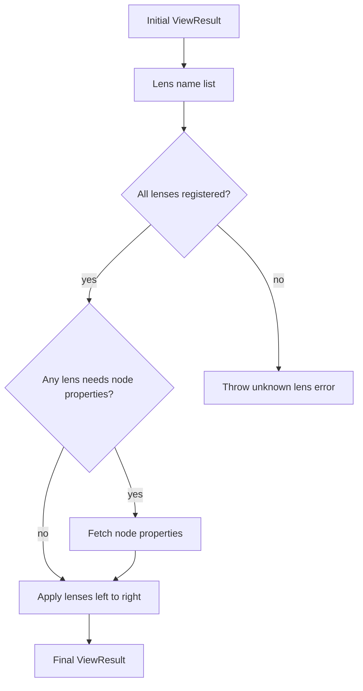
```mermaid
flowchart TD
    ViewResult["Initial ViewResult"]
    LensNames["Lens name list"]
    Lookup{"All lenses registered?"}
    Props{"Any lens needs node properties?"}
    FetchProps["Fetch node properties"]
    Compose["Apply lenses left to right"]
    Result["Final ViewResult"]
    Error["Throw unknown lens error"]

    ViewResult --> LensNames
    LensNames --> Lookup
    Lookup -->|no| Error
    Lookup -->|yes| Props
    Props -->|yes| FetchProps
    Props -->|no| Compose
    FetchProps --> Compose
    Compose --> Result
```

The most interesting lens is `critical-path`. It knows that `blocks` and
`depends-on` encode order in opposite directions. A `blocks` edge already points
from predecessor to successor. A `depends-on` edge points from dependent to
dependency, so the lens reverses it before computing the longest path.

## Golden Path Five: Time Travel And Semantic Diff

Time travel is built from epoch nodes. A post-commit hook can call
`git mind process-commit <sha>`. That command parses commit directives and then
records an epoch marker that maps the Git commit SHA to the current WARP Lamport
tick.

### Epochs

```json
{
  "node": "epoch:6aeec3bd65db",
  "properties": {
    "tick": 128,
    "fullSha": "6aeec3bd65dbd57ac627f5acd696d6601b0e9a70",
    "recordedAt": "2026-06-01T05:41:11.000Z"
  }
}
```

When a user asks for `git mind at HEAD~5`, Git Mind resolves `HEAD~5` to a SHA,
looks for `epoch:<sha-prefix>`, falls back to a nearby ancestor epoch if needed,
and materializes the graph at that tick.

### Context Resolution

Context-aware read commands use `ContextEnvelope`. The default context is
`HEAD`, no observer, open trust policy, and no extension lock.

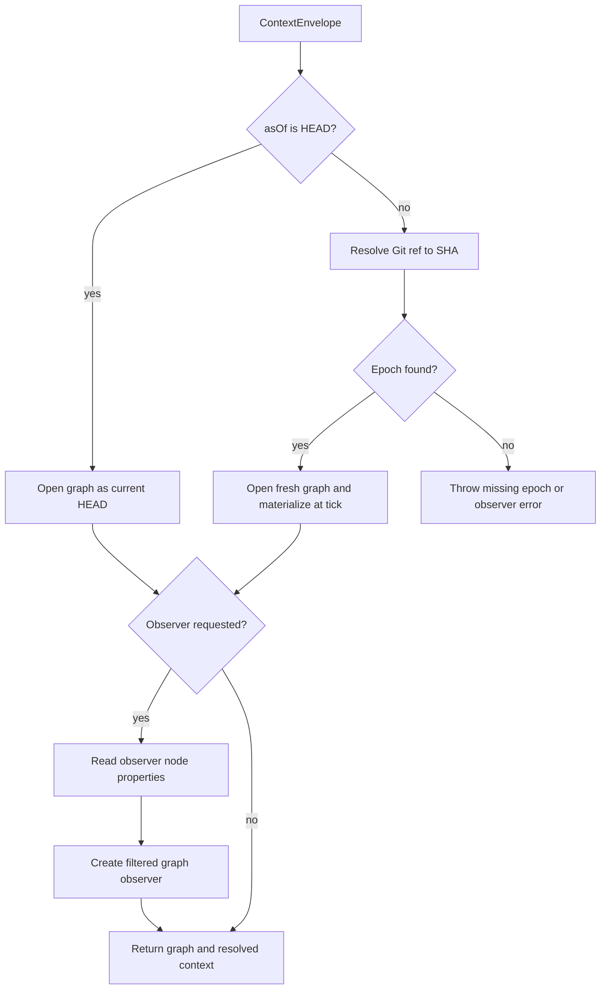
```mermaid
flowchart TD
    Envelope["ContextEnvelope"]
    Head{"asOf is HEAD?"}
    OpenHead["Open graph as current HEAD"]
    ResolveRef["Resolve Git ref to SHA"]
    FindEpoch{"Epoch found?"}
    Materialize["Open fresh graph and materialize at tick"]
    Observer{"Observer requested?"}
    LoadObserver["Read observer node properties"]
    ApplyObserver["Create filtered graph observer"]
    Return["Return graph and resolved context"]
    Error["Throw missing epoch or observer error"]

    Envelope --> Head
    Head -->|yes| OpenHead
    Head -->|no| ResolveRef
    ResolveRef --> FindEpoch
    FindEpoch -->|no| Error
    FindEpoch -->|yes| Materialize
    OpenHead --> Observer
    Materialize --> Observer
    Observer -->|yes| LoadObserver
    LoadObserver --> ApplyObserver
    ApplyObserver --> Return
    Observer -->|no| Return
```

### Semantic Diff

`computeDiff()` opens three graph instances. The resolver finds epochs for both
refs. The before graph materializes at tick A. The after graph materializes at
tick B. The diff engine then compares node sets and edge sets.

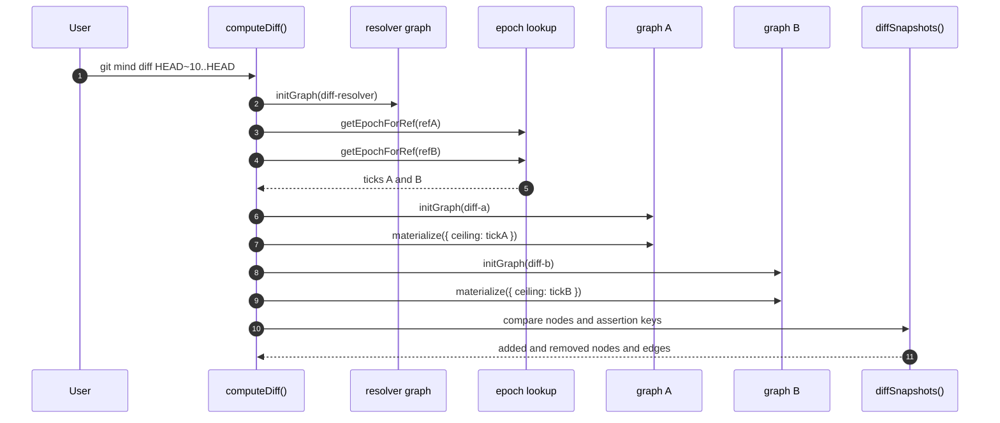
```mermaid
sequenceDiagram
    autonumber
    participant User
    participant Diff as computeDiff()
    participant Resolver as resolver graph
    participant Epoch as epoch lookup
    participant GraphA as graph A
    participant GraphB as graph B
    participant Compare as diffSnapshots()

    User->>Diff: git mind diff HEAD~10..HEAD
    Diff->>Resolver: initGraph(diff-resolver)
    Diff->>Epoch: getEpochForRef(refA)
    Diff->>Epoch: getEpochForRef(refB)
    Epoch-->>Diff: ticks A and B
    Diff->>GraphA: initGraph(diff-a)
    Diff->>GraphA: materialize({ ceiling: tickA })
    Diff->>GraphB: initGraph(diff-b)
    Diff->>GraphB: materialize({ ceiling: tickB })
    Diff->>Compare: compare nodes and assertion keys
    Compare-->>Diff: added and removed nodes and edges
```

This is a distinctive design choice. `materialize({ ceiling })` is treated as
destructive, so the code does not try to reuse one graph instance for both sides
of a diff. It spends more setup work to avoid temporal state contamination.

## Golden Path Six: Suggestions And Review

The suggestion flow is the bridge between repository context and AI-assisted
graph growth. Git Mind does not embed an AI provider. Instead, it shells out to
the command configured by `GITMIND_AGENT` or supplied with `--agent`.

### Suggestion Flow

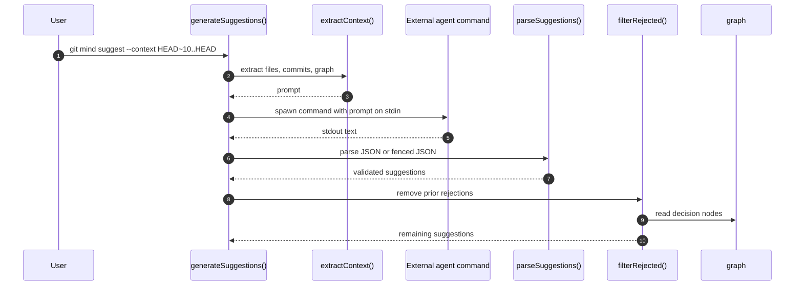
```mermaid
sequenceDiagram
    autonumber
    participant User
    participant Suggest as generateSuggestions()
    participant Context as extractContext()
    participant Agent as External agent command
    participant Parser as parseSuggestions()
    participant Filter as filterRejected()
    participant Graph as graph

    User->>Suggest: git mind suggest --context HEAD~10..HEAD
    Suggest->>Context: extract files, commits, graph
    Context-->>Suggest: prompt
    Suggest->>Agent: spawn command with prompt on stdin
    Agent-->>Suggest: stdout text
    Suggest->>Parser: parse JSON or fenced JSON
    Parser-->>Suggest: validated suggestions
    Suggest->>Filter: remove prior rejections
    Filter->>Graph: read decision nodes
    Filter-->>Suggest: remaining suggestions
```

The prompt includes known node prefixes, edge types, existing nodes, existing
edges, recent commits, and tracked files. The parser accepts raw JSON arrays and
JSON inside Markdown code fences. It validates node IDs, edge types, and
confidence values before returning suggestions.

### Suggestion Payload

```json
[
  {
    "source": "file:src/graph.js",
    "target": "spec:graph-schema",
    "type": "implements",
    "confidence": 0.7,
    "rationale": "graph.js opens and adapts the WARP graph specified by the schema"
  }
]
```

### Review Decisions

Review operates on low-confidence edges already in the graph. `getPendingSuggestions()`
finds edges below the low-confidence threshold and excludes edges that already
have a decision node.

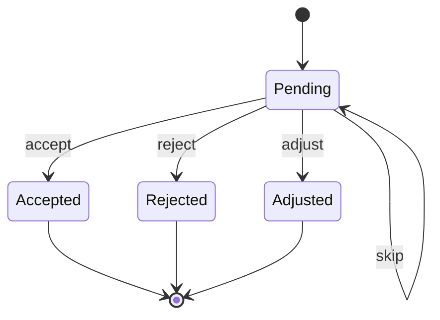
```mermaid
stateDiagram-v2
    [*] --> Pending
    Pending --> Accepted: accept
    Pending --> Rejected: reject
    Pending --> Adjusted: adjust
    Pending --> Pending: skip
    Accepted --> [*]
    Rejected --> [*]
    Adjusted --> [*]
```

An accepted suggestion is promoted to confidence `1.0`, gets `reviewedAt`, and
gets a `decision:` node. A rejected suggestion removes the edge and records a
decision. An adjusted suggestion may update confidence, rationale, or type, and
records the decision in the same patch. A skipped suggestion is deliberately not
persisted, so it can reappear later.

Decision IDs are generated from the assertion tuple plus the current Unix
timestamp. The tuple hash ties the decision to the assertion. The timestamp
allows more than one review event over time.

## Golden Path Seven: Content On Node

Content-on-node lets a graph node carry rich content without turning every large
body into a node property. `writeContent()` checks that the node exists, converts
the content to a buffer, attaches it through WARP, stores MIME and size metadata,
commits the patch, and reads back the content object ID.

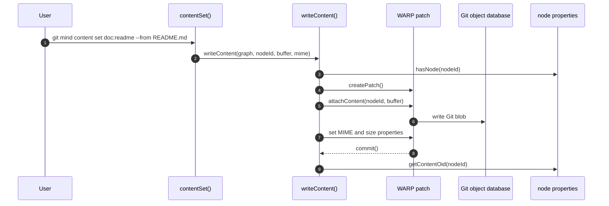
```mermaid
sequenceDiagram
    autonumber
    participant User
    participant Command as contentSet()
    participant Content as writeContent()
    participant Patch as WARP patch
    participant Store as Git object database
    participant Graph as node properties

    User->>Command: git mind content set doc:readme --from README.md
    Command->>Content: writeContent(graph, nodeId, buffer, mime)
    Content->>Graph: hasNode(nodeId)
    Content->>Patch: createPatch()
    Content->>Patch: attachContent(nodeId, buffer)
    Patch->>Store: write Git blob
    Content->>Patch: set MIME and size properties
    Patch-->>Content: commit()
    Content->>Graph: getContentOid(nodeId)
```

Content deletion clears the content properties, but the Git blob remains in the
object database until normal Git maintenance can garbage-collect unreachable
objects. This is the right local-first trade-off: graph semantics change
immediately, while Git object cleanup remains Git's job.

## Golden Path Eight: Extensions

Extensions are manifest-driven. They are not arbitrary code plugins. An
extension manifest declares domain prefixes, views, lenses, rules, sync
adapters, and materializers. Git Mind validates the manifest with AJV against
`docs/contracts/extension-manifest.schema.json`, normalizes optional arrays, and
registers the extension.

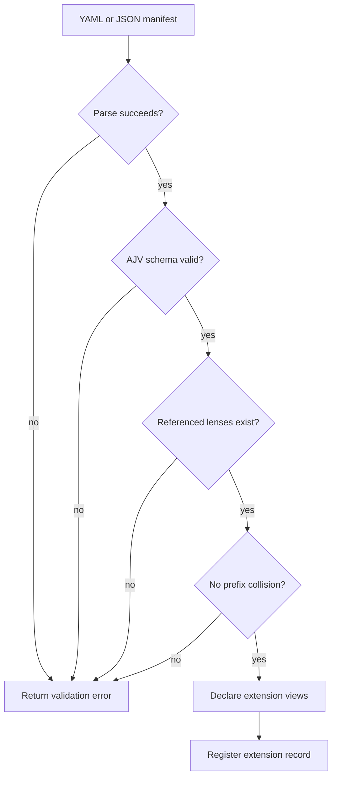
```mermaid
flowchart TD
    Manifest["YAML or JSON manifest"]
    Parse{"Parse succeeds?"}
    Schema{"AJV schema valid?"}
    Lenses{"Referenced lenses exist?"}
    Prefixes{"No prefix collision?"}
    Views["Declare extension views"]
    Registry["Register extension record"]
    Error["Return validation error"]

    Manifest --> Parse
    Parse -->|no| Error
    Parse -->|yes| Schema
    Schema -->|no| Error
    Schema -->|yes| Lenses
    Lenses -->|no| Error
    Lenses -->|yes| Prefixes
    Prefixes -->|no| Error
    Prefixes -->|yes| Views
    Views --> Registry
```

This design favors declarative extension points over arbitrary executable code.
The trade-off is reduced extension power in exchange for safer validation,
predictable contracts, and easier review.

Built-in extension manifests live under `extensions/roadmap` and
`extensions/architecture`. `registerBuiltinExtensions()` loads them once and
marks them as built-in so they cannot be removed through the normal extension
removal path.

## Golden Path Nine: Cross-Repository Merge

Cross-repository merge reads another local repository's Git Mind graph and
qualifies every imported node with `repo:owner/name:`. This avoids collisions
between local and remote node IDs.

```mermaid
sequenceDiagram
    autonumber
    participant User
    participant MergeCmd as mergeCmd()
    participant Merge as mergeFromRepo()
    participant Remote as remote graph
    participant Local as local graph
    participant Patch as local patch

    User->>MergeCmd: git mind merge --from ../other-repo
    MergeCmd->>Merge: mergeFromRepo(localGraph, path)
    Merge->>Merge: detect repo identifier
    Merge->>Remote: initGraph(remoteRepoPath)
    Merge->>Remote: getNodes() and getEdges()
    Merge->>Patch: add qualified nodes
    Merge->>Patch: copy node properties
    Merge->>Patch: add qualified edges
    Merge->>Patch: copy confidence and rationale
    Patch-->>Local: commit()
```

### Cross-Repository IDs

The ID `repo:flyingrobots/echo:module:wal` means the local graph is talking
about `module:wal` from the repository identified as `flyingrobots/echo`. The
inner prefix remains `module`, so prefix extraction can still reason about the
kind of thing being referenced.

## Unhappy Paths And Error Handling

Git Mind's CLI command functions generally catch errors, print a formatted error
message, and set `process.exitCode = 1`. They do not usually throw through to
Node's default unhandled exception output.

```mermaid
flowchart TD
    Command["Command starts"]
    Validate{"Input valid?"}
    OpenGraph{"Graph opens?"}
    Domain{"Domain operation succeeds?"}
    Output{"Output succeeds?"}
    Success["Exit code 0"]
    Failure["Print error and set exit code 1"]
    Pipe{"Broken pipe?"}
    IgnorePipe["Treat EPIPE as clean shutdown"]

    Command --> Validate
    Validate -->|no| Failure
    Validate -->|yes| OpenGraph
    OpenGraph -->|no| Failure
    OpenGraph -->|yes| Domain
    Domain -->|no| Failure
    Domain -->|yes| Output
    Output --> Pipe
    Pipe -->|yes| IgnorePipe
    Pipe -->|no| Success
    IgnorePipe --> Success
```

Malformed CLI usage is caught at the entry point or command boundary. Missing
required positionals such as a `link` target produce usage text and a non-zero
exit code.

Import failures are returned as structured `ImportResult` objects when possible.
A missing file, empty YAML document, unsupported version, malformed node, invalid
edge type, invalid confidence value, or undeclared edge endpoint prevents writes.

Historical read failures happen when a Git ref cannot be resolved or no epoch
marker exists for the ref or its ancestors. The error message tells the user to
run `git mind process-commit` so epoch markers can be recorded.

Agent failures include missing `GITMIND_AGENT`, process start failure, timeout,
non-zero exit, empty output, invalid JSON, non-array output, or invalid
suggestion items. The external agent is outside Git Mind's reliability boundary,
so Git Mind validates everything it receives.

Extension failures include missing manifest files, YAML or JSON parse errors,
schema violations, unknown referenced lenses, and prefix collisions with another
extension.

Content failures include missing source files, writing content to a missing
node, reading a node with no content, and content object lookup failure after a
blob has supposedly been written.

The entry point has a notable pipe-safety detail. At shutdown it writes an empty
string to stdout and stderr to flush streams. If the stream reports `EPIPE` or
`ERR_STREAM_DESTROYED`, it resolves rather than crashing. This matters when users
pipe output to commands such as `head`, which may close the pipe early.

## Concurrency And Async Behavior

Git Mind is asynchronous because it performs file I/O, Git subprocess calls,
WARP graph operations, external process execution, and interactive terminal
input. It is not a server with request concurrency, and it does not run a worker
pool.

The important concurrency boundary is the WARP graph. Writes are grouped into
patches and committed. WARP supplies the CRDT-style Git-backed substrate, which
is why the project can rely on replay and merge behavior instead of a central
database transaction coordinator.

Some flows deliberately use multiple graph instances. Time travel and diff are
the best examples. Since materialization at a ceiling is treated as destructive,
`computeDiff()` opens separate graph instances for resolver, before snapshot,
and after snapshot. That is extra setup cost, but it prevents one historical
materialization from contaminating another read.

The review module explicitly assumes a single-writer edge existence model for
some operations. For example, `acceptSuggestion()` assumes the low-confidence
edge still exists when it sets edge properties. If another process deletes the
edge at exactly the same time, the underlying graph operation may fail. That is a
reasonable CLI trade-off today, but a long-running daemon or multi-user service
would need a stronger conflict-resolution story at the review boundary.

## External Dependencies And Borders

Git Mind's most important dependency is `@git-stunts/git-warp`. That is where
graph persistence, patches, materialization, observer surfaces, content
attachment, and WARP-specific semantics live. Git Mind wraps that dependency but
does not reimplement it.

`@git-stunts/plumbing` is the Git plumbing layer used by `GitGraphAdapter`.
Git Mind relies on it to talk to the local Git repository.

`js-yaml` parses YAML import files, Markdown frontmatter blocks, and extension
manifests. `ajv` validates extension manifests against a JSON Schema. `chalk`
and `figures` support terminal formatting. `vitest` and `eslint` are development
dependencies for tests and linting.

Git itself is also an external boundary. Several modules call the `git`
executable through `execFileSync`: context extraction, epoch lookup, commit
processing, and repository identifier detection. These calls pass arguments as
arrays rather than shell strings. The suggestion flow is the exception that
intentionally uses `spawn(cmd, { shell: true })` because it accepts a user
configured agent command.

```mermaid
flowchart TD
    GitMind["Git Mind code"]
    Warp["git-warp"]
    Plumbing["git-stunts plumbing"]
    Git["Local git executable and object database"]
    YAML["js-yaml"]
    AJV["AJV"]
    Agent["External AI agent command"]

    GitMind --> Warp
    Warp --> Plumbing
    Plumbing --> Git
    GitMind --> YAML
    GitMind --> AJV
    GitMind --> Agent
```

## Security Boundaries And Trust

Git Mind does not currently implement user accounts, JWTs, OAuth flows, session
cookies, or remote authorization. It is a local CLI that operates in the current
Git repository with the permissions of the invoking OS user.

That does not mean there are no security boundaries. The main boundary is local
execution authority. If a user can run `git mind`, they can mutate the local
Git-backed graph. If they configure `GITMIND_AGENT`, Git Mind will spawn that
command with shell semantics. That is powerful and intentionally user-controlled.

The code is careful in places where Git arguments are derived from input.
`extractCommitContext()` rejects dangerous characters and leading hyphens before
using a user-provided Git range. Most Git subprocess calls use `execFileSync`
with argument arrays rather than shell interpolation.

Observer and trust-policy fields exist in `ContextEnvelope`, but the trust
policy is not yet a fully enforced authorization model. Observer filtering is
graph-backed: an observer is a node such as `observer:alice` with a required
`match` property and optional expose/redact properties. The graph's observer
surface then returns a filtered graph.

### Observers And Trust Context

```json
{
  "node": "observer:public",
  "properties": {
    "match": "doc:*",
    "redact": "rationale"
  }
}
```

The current boundary is best understood as deterministic local filtering, not
access control against a hostile user. A future hosted or multi-user Git Mind
would need explicit identity, policy enforcement, and audit semantics.

## Configuration And Environment Tuning

Most configuration is command-line state, not a global config file.

| Control | Effect |
|---------|--------|
| `--json` | Emits schema-versioned machine-readable output for supported commands. |
| `--at <ref>` | Resolves a historical context and materializes a graph at an epoch tick. |
| `--observer <name>` | Reads through a named graph observer. |
| `--trust <policy>` | Stores trust policy in the context envelope; enforcement is still limited. |
| `--prefix <prefix>` | Filters nodes, exports, or diffs by prefix. |
| `--dry-run` / `--validate` | Validates import or merge behavior without writing. |
| `--agent <command>` | Overrides `GITMIND_AGENT` for suggestion generation. |
| `GITMIND_AGENT` | Defines the external AI command used by `git mind suggest`. |
| `GITMIND_DEBUG` | Enables debug logging for epoch recording failure in commit processing. |

There are also hard-coded tuning decisions. Suggestion agent calls time out
after 120 seconds by default. Context extraction limits tracked files to 200 and
recent commits to 10 by default. Prompt construction truncates at 4000
characters unless a caller supplies a different maximum. Epoch ancestor fallback
walks at most 100 commits by default.

These constants are conservative. They keep local CLI runs predictable, but they
also mean large monorepos will need more deliberate bootstrap and indexing
features rather than relying on the current suggestion prompt builder alone.

## Why It Is Built This Way

Git Mind stores state in Git because the knowledge it records is about the
repository itself. Keeping graph state beside repository history means semantic
facts can be cloned, branched, merged, replayed, and diffed with the project.
The trade-off is that every operation must respect Git and WARP mechanics, which
can be slower and more complex than writing rows to a local database.

The CLI uses manual parsing because the command surface is still small and
because explicit switch cases make behavior easy to audit. The trade-off is that
the project must maintain parsing details such as boolean flags, positional
extraction, and usage text itself.

The graph compatibility adapter exists because the WARP substrate moved from
older method shapes to newer surfaces. The adapter preserves Git Mind's internal
API and contains upgrade friction in one file. The trade-off is that the adapter
must be tested carefully so it does not hide upstream behavior changes.

The import path validates before writing and writes in one patch. This prevents
half-imported graph state. The trade-off is that very large imports may produce
large patches and validation must load enough context to check references.

Views and lenses are separated because a view answers "which subgraph matters?"
while a lens answers "which part of that subgraph should I focus on right now?"
This keeps combinations such as `roadmap:incomplete:frontier` natural. The
trade-off is that lens composition can surprise users if they expect OR-style
filtering; the current lenses mostly use AND-style endpoint preservation.

The AI suggestion system shells out instead of binding to one vendor SDK. This
keeps the core product vendor-neutral and local-friendly. The trade-off is that
the user must configure an agent command, and Git Mind must treat the agent's
output as untrusted text until parsed and validated.

The review system records decisions as graph nodes rather than external UI
state. That is important because review decisions become part of repository
meaning and can travel with the graph. The trade-off is more graph noise, which
is why export and diff exclude `decision:` nodes by default.

## Ten Use Cases

1. **Onboard to an unfamiliar repository.**
   A user can inspect nodes, views, docs imports, and planned bootstrap output to
   discover important artifacts and relationships.

2. **Answer what implements a spec.**
   A user can query or view `implements` edges from code, tasks, or modules to
   `spec:` nodes.

3. **Find architectural dependencies.**
   A user can use the `architecture` view and dependency-oriented lenses to
   inspect module relationships.

4. **Review project blockers.**
   A user can use the `blockers` view and `blocked` lens to identify blocked
   work and blocking chains.

5. **Compare semantic change between commits.**
   A user can run `git mind diff A..B` after epoch markers have been recorded.

6. **Preserve review decisions.**
   A user can accept, reject, or adjust low-confidence assertions and store those
   decisions in the graph.

7. **Attach rich explanation to a node.**
   A user can use content-on-node to attach Markdown or text to an existing
   semantic node.

8. **Merge knowledge from another repository.**
   A user can run `git mind merge --from` to qualify another repo's graph into
   the local graph.

9. **Generate graph suggestions with an agent.**
   A user can configure `GITMIND_AGENT` and run `git mind suggest` to propose new
   semantic edges.

10. **Validate graph health.**
    A user can run `git mind doctor` to find dangling edges, orphan milestones,
    orphan nodes, and low-confidence assertions.

## Future Directions

The near-term product direction is Hill 1: zero-input semantic bootstrap. The
planned feature profiles describe a command that inventories repository
artifacts, extracts entities, infers conservative relationships, records
confidence and provenance, and presents weak assertions for review.

Hill 2 is queryable answers with receipts. The graph already has many of the
substrate pieces: assertion identity, confidence, historical reads, views,
export contracts, and review decisions. The missing layer is a question-oriented
answer surface that returns direct answers plus the assertions and evidence that
support them.

Hill 3 is a living map with low manual upkeep. The existing post-commit hook,
epoch machinery, review flow, doctor checks, and diff support are ingredients.
The future product needs incremental update behavior that notices repository
changes, refreshes affected facts, retires stale inferences, and asks humans or
agents to review only the uncertain parts.

The design docs also point toward stronger agent contracts, trust observers,
extension runtime maturity, import/export interchange, fixture-based upgrade
testing, and richer graph data model enforcement.

## Key Features And Design Decisions

Git Mind is a local-first semantic repository graph. Its key feature is not just
that it stores nodes and edges. Its key feature is that it stores repository
meaning in Git, alongside the repository whose meaning it describes.

The most important implementation decisions are the WARP compatibility boundary,
patch-based atomic writes, tuple-based assertion identity, schema-validated
imports, import-compatible exports, context envelopes for historical and
observer-aware reads, multi-instance materialization for diffs, composable
views/lenses, decision nodes for review provenance, external-agent suggestions,
and manifest-validated extensions.

The current system is already useful for explicit graph work and repository
knowledge inspection. The next major product proof is whether Git Mind can make
that graph appear with low manual effort and then answer real engineering
questions with receipts.
