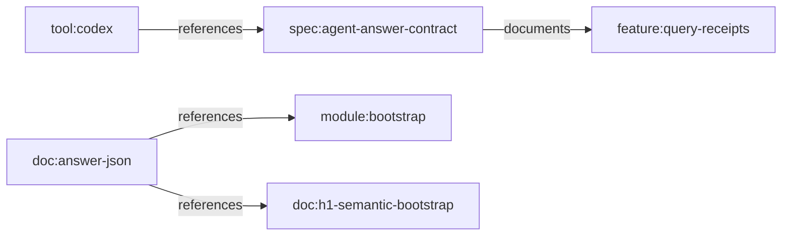

# Feature Profile: Agent Contracts

Status: draft for Hill 2 implementation

Related:

- [CLI Contracts](../../contracts/CLI_CONTRACTS.md)
- [Git Mind Product Frame](../git-mind.md)

## IBM Design Thinking Frame

Sponsor user:

- An autonomous coding agent operating on repository knowledge.

Job to be done:

- When I use Git Mind as a machine-facing contract boundary, give me stable
  commands, schemas, error behavior, and receipts I can trust.

Hill:

- Hill 2: Queryable answers with receipts.

Playback evidence:

- An agent can call Git Mind commands, parse JSON responses, handle typed
  errors, and cite receipts without prompt-specific guesswork.

## User Stories

- As an agent, I can request JSON for every read-oriented command.
- As an agent, I can validate responses against schemas.
- As an agent, I can tell no-answer, low-confidence answer, and command failure
  apart.
- As a maintainer, I can detect contract drift in CI.

## Requirements

### Functional

- Every machine-facing JSON output must include `schemaVersion`.
- CLI commands must have predictable exit codes and typed error envelopes.
- Schemas must exist for stable command families.
- Contract tests must exercise representative command output.
- Agent-facing docs must state which commands are stable, transitional, or
  experimental.

### Non-Functional

- Contracts must be deterministic.
- Breaking changes require versioning.
- Human formatting changes must not break JSON contracts.

## Graph Data Model Usage

Agent contracts expose [Graph Data Model](../graph-data-model.md) through
machine-readable payloads. Agents should receive canonical node IDs, edge
types, confidence, evidence, and graph refs rather than prose-only context.

## Test Plan

Fixtures:

- `contract-canary-repo`
- `no-answer-repo`
- `invalid-command-repo`
- `large-output-repo`

Golden path:

- JSON outputs validate against schemas.
- Error outputs distinguish usage, validation, graph, and environment failures.
- Contract canaries cover status, nodes, views, export, import, review, diff,
  content, and future query responses.

Edge cases:

- Empty graph.
- Large graph.
- No-answer query.
- Low-confidence answers.
- Observer/trust-filtered contexts.

Known failures:

- Missing `schemaVersion` fails CI.
- Unknown JSON field policy is explicit.
- Invalid command args return typed error.

Fuzz:

- Generate valid and invalid command arguments.
- Generate schema-valid and schema-invalid payloads.
- Generate random graph state and validate JSON stability.

Stress:

- Large JSON output with bounded memory.
- Repeated command invocation from clean environment.
- Parallel command reads.

Regression:

- Contract snapshots remain stable.
- Error taxonomy does not collapse into generic failures.
- JSON mode never prints decorative human text.

Golden artifacts:

- JSON schema files.
- Golden command outputs.
- Error envelope snapshots.

Playback:

- A coding agent can use Git Mind as a deterministic repo-knowledge API instead
  of relying on fragile prompt context.
