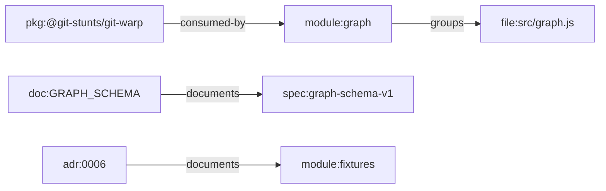

# Feature Profile: Artifact Inventory

Status: draft for Hill 1 implementation

Related:

- [Hill 1 Semantic Bootstrap Spec](../h1-semantic-bootstrap.md)
- issue [#306](https://github.com/flyingrobots/git-mind/issues/306)

## IBM Design Thinking Frame

Sponsor user:

- A maintainer or agent entering an unfamiliar repository.

Job to be done:

- When Git Mind scans a repo, identify the artifacts worth reasoning about and
  ignore noise without requiring custom configuration first.

Hill:

- Hill 1: Zero-input semantic bootstrap.

Playback evidence:

- On a representative repo, the inventory correctly classifies source files,
  Markdown docs, ADRs, key project files, commit history, and repo-local
  references while excluding generated and vendored noise.

## User Stories

- As a user, I can run bootstrap without telling Git Mind where every source and
  doc directory lives.
- As an agent, I can inspect inventory JSON before inference and understand what
  the scanner considered.
- As a maintainer, I can see warnings for skipped or ambiguous artifacts.

## Requirements

### Functional

- Walk the repository file tree using Git-aware boundaries.
- Respect `.gitignore` and internal scan excludes.
- Classify source files, Markdown docs, ADR docs, key project files, package
  manifests, and binary/unsupported files.
- Extract basic metadata: path, kind, size, language, hash, and reason.
- Capture recent commit metadata needed by later inference.
- Surface skipped artifacts with reason codes.

### Non-Functional

- Inventory order must be deterministic.
- Scanner must avoid loading huge files into memory by default.
- Scan policy must be explainable in JSON output.
- The first version must be local-only and credential-free.

## Classification Model

Initial artifact kinds:

- `source`
- `doc`
- `adr`
- `manifest`
- `config`
- `test`
- `generated`
- `vendor`
- `binary`
- `unsupported`

## Graph Data Model Usage

Artifact inventory owns the first stable mapping from repository paths to
canonical artifact and subject nodes in
[Graph Data Model](../graph-data-model.md). It should classify what can become
`file:`, `doc:`, `adr:`, `spec:`, `module:`, and `pkg:` nodes before inference
tries to connect them.

## Test Plan

Fixtures:

- `minimal-doc-code`
- `adr-linked-service`
- `polyglot-service` with JS, Python, Rust, and Markdown.
- `noisy-repo` with `node_modules`, `dist`, vendored code, lockfiles, and
  generated docs.

Golden path:

- Inventory classifies README, docs, ADRs, source, tests, and manifests.
- JSON output contains stable counts by artifact kind.
- Ignored files do not enter the inferred artifact set.

Edge cases:

- Uppercase `README`, nested ADR directories, empty files, very small files.
- Extensionless executable scripts.
- Markdown files with no headings.
- Binary files with misleading extensions.
- Repos with submodules or nested Git directories.

Known failures:

- Unreadable files must be reported with a warning or typed error.
- Broken symlinks must not crash inventory.
- Paths outside repo root must be rejected.
- Huge files over the policy limit must be skipped with a reason.

Fuzz:

- Generate file names with spaces, unicode-like escaped sequences, dots, and
  deeply nested directories.
- Generate random binary/text prefix data to test MIME or text detection.
- Generate random ignore patterns and verify excluded paths stay excluded.

Stress:

- 100k path entries in a synthetic repo tree.
- 10k Markdown/source files with bounded content reads.
- Deep directory tree near platform path limits.

Regression:

- No traversal into `.git`.
- No inclusion of `node_modules` by default.
- No nondeterministic ordering from filesystem traversal.
- No hidden dependency on current shell working directory.

Golden artifacts:

- Inventory JSON for `minimal-doc-code`, `adr-linked-service`, and
  `noisy-repo`.
- Skipped-artifact reason-code catalog.

Playback:

- The user can read the inventory summary and say, "Yes, Git Mind scanned the
  repo I care about and ignored the obvious noise."
