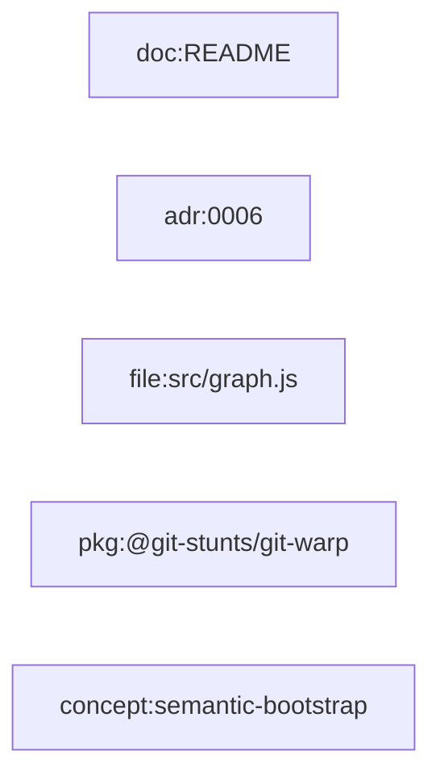

# Feature Profile: Entity Extraction

Status: draft for Hill 1 implementation

Related:

- [Hill 1 Semantic Bootstrap Spec](../h1-semantic-bootstrap.md)
- issue [#304](https://github.com/flyingrobots/git-mind/issues/304)

## IBM Design Thinking Frame

Sponsor user:

- A maintainer or agent trying to understand repo artifacts without manually
  naming every node.

Job to be done:

- When Git Mind inventories a repo, synthesize useful semantic nodes from the
  artifacts so later inference has stable graph endpoints.

Hill:

- Hill 1: Zero-input semantic bootstrap.

Playback evidence:

- Bootstrap creates useful `file:`, `doc:`, `adr:`, conservative `module:`,
  `issue:`, and `pr:` nodes from repo-local evidence. History-aware bootstrap
  may also create system-owned `commit:` nodes through Git Mind's system writer.

## User Stories

- As a user, I can see docs, ADRs, and source files as graph nodes after
  bootstrap without writing frontmatter.
- As an agent, I can map a file path or ADR path to the node ID Git Mind chose.
- As a reviewer, I can distinguish inferred nodes from manually authored nodes.

## Requirements

### Functional

- Generate stable node IDs for discovered files and docs.
- Extract ADR IDs from filename, title, or repo convention where possible.
- Infer conservative module nodes only from durable structure such as package
  manifests or clear directory boundaries.
- Create placeholder `issue:` and `pr:` nodes only from repo-local textual
  references.
- Preserve provenance for why each entity exists.
- Avoid overwriting manual node properties unless explicitly owned by bootstrap.

### Non-Functional

- Node IDs must be deterministic across machines.
- Extraction must prefer lower-level accurate nodes over fake abstractions.
- Unknown or ambiguous entities should be warnings, not invented truth.

## Node Ownership

Bootstrap-created properties should be namespaced or clearly identifiable so
manual curation can coexist with inferred metadata.

Candidate properties:

- `gitmind.inferred`
- `gitmind.extractor`
- `gitmind.sourceRef`
- `gitmind.lastSeen`
- `gitmind.kind`

## Graph Data Model Usage

Entity extraction creates the node side of
[Graph Data Model](../graph-data-model.md). It should emit stable IDs and node
properties before relationship inference adds semantic edges.

## Test Plan

Fixtures:

- `minimal-doc-code`
- `adr-linked-service`
- `monorepo-packages`
- `issue-pr-reference-docs`

Golden path:

- Source files become `file:` nodes.
- Markdown docs become `doc:` nodes.
- ADR files become `adr:` nodes.
- Package boundaries become conservative `module:` nodes.
- Commit metadata produces system-owned `commit:` nodes when bootstrap includes
  history.
- `#123` and `PR #45` references create placeholder `issue:` and `pr:` nodes.

Edge cases:

- Duplicate basenames in different directories.
- ADR filenames with several numbering conventions.
- Docs with explicit IDs that collide with generated IDs.
- Package manifests in nested workspaces.
- Issue-like numbers in code comments that should not become issue nodes.

Known failures:

- Invalid node IDs must fail or be normalized with explicit reason.
- Collisions must be reported and deterministic.
- Missing package metadata must prevent module inference rather than guessing.
- YAML/frontmatter imports that try to author `commit:` or `epoch:` nodes must
  remain rejected by the graph schema.

Fuzz:

- Generate random paths and ensure generated IDs are valid or rejected.
- Generate ADR naming variants.
- Generate issue/PR reference strings with false positives.

Stress:

- 50k file entities.
- 5k docs with titles and references.
- Monorepo with hundreds of packages.

Regression:

- Manual node properties survive repeated bootstrap runs.
- Node ID casing is stable.
- Entity extraction does not depend on filesystem order.

Golden artifacts:

- Entity extraction JSON for each base repo.
- Graph export after entity-only bootstrap.
- Collision warning snapshots.

Playback:

- A maintainer can ask "what did Git Mind decide exists in this repo?" and see
  a useful first-pass entity map before relationship inference.
