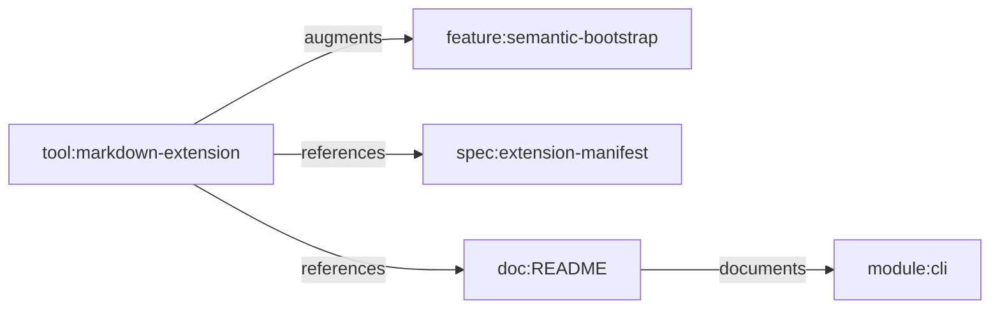

# Feature Profile: Extensions Runtime

Status: active supporting-lane profile

Related:

- [Git Mind Product Frame](../git-mind.md)
- issue [#261](https://github.com/flyingrobots/git-mind/issues/261)
- issue [#269](https://github.com/flyingrobots/git-mind/issues/269)

## IBM Design Thinking Frame

Sponsor user:

- A tool builder or team adapting Git Mind to repo-specific workflows.

Job to be done:

- When core Git Mind does not know a local workflow, let an extension add
  validated behavior without weakening core contracts.

Lane:

- Supporting lane: extensions.

Playback evidence:

- A valid extension manifest can be validated, registered, listed, and used in a
  predictable way across command invocations.

## User Stories

- As a tool builder, I can validate an extension manifest before registration.
- As a maintainer, I can list registered extensions.
- As an agent, I can load an extension for one command or use persisted
  registration once implemented.
- As a reviewer, I can reject unsafe or malformed extension manifests.

## Requirements

### Functional

- Validate extension manifest against schema.
- Register and unregister extensions.
- List registered extensions in human and JSON forms.
- Define persistence semantics for registration.
- Define one-shot extension loading semantics.

### Non-Functional

- Extensions must not bypass core validation.
- Manifest errors must be typed and actionable.
- Extension loading must not create hidden network or host coupling.

## Graph Data Model Usage

Extensions can read or propose writes to
[Graph Data Model](../graph-data-model.md), but their output must use canonical
prefixes, edge types, confidence, and origin metadata. Extension-specific
semantics should be modeled as `tool:`, `spec:`, or documented feature nodes
before adding new vocabulary.

## Test Plan

Fixtures:

- `valid-extension`
- `invalid-manifest`
- `ephemeral-extension`
- `persistent-extension`

Golden path:

- Validate manifest succeeds.
- Add/register extension and list it.
- Remove extension and list no longer includes it.
- JSON outputs validate.

Edge cases:

- Duplicate extension name.
- Version mismatch.
- Missing entrypoint.
- Relative and absolute paths.
- Extension path removed after registration.

Known failures:

- Invalid manifest fails.
- Unsafe path escapes fail.
- Persistence not implemented must be explicit until fixed.

Fuzz:

- Generate manifest field combinations.
- Generate path variants.
- Generate extension names and versions.

Stress:

- Many registered extensions.
- Repeated add/remove/list loop.
- Parallel command invocation with extension registry reads.

Regression:

- Extension registration semantics do not silently change.
- Invalid manifests cannot partially register.
- JSON contract remains stable.

Golden artifacts:

- Valid and invalid manifests.
- Registry JSON snapshots.
- Error envelope snapshots.

Playback:

- Extensions make local workflows possible without turning core Git Mind into an
  unsafe plugin free-for-all.
