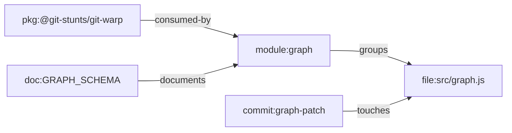

# Feature Profile: Graph Substrate

Status: active supporting-lane profile

Related:

- [git-warp Upgrade Audit](../git-warp-upgrade-audit.md)
- [Repo Fixture Strategy](../repo-fixture-strategy.md)
- issue [#312](https://github.com/flyingrobots/git-mind/issues/312)
- issue [#320](https://github.com/flyingrobots/git-mind/issues/320)

## IBM Design Thinking Frame

Sponsor user:

- A maintainer or agent relying on Git Mind facts across branches, history, and
  clones.

Job to be done:

- When semantic facts are stored, keep them Git-native, replayable, mergeable,
  and testable without an external database.

Lane:

- Supporting lane: foundation.

Playback evidence:

- Graph state survives init, mutation, reload, historical materialization,
  export, and upgrade fixture migration on the current git-warp substrate.

## User Stories

- As a maintainer, I can store graph meaning inside Git.
- As an agent, I can rely on deterministic reads after reload.
- As a reviewer, I can inspect semantic changes as Git-backed state.
- As a maintainer, I can upgrade the substrate with fixture proof.

## Requirements

### Functional

- Initialize and open the Git Mind graph idempotently.
- Create patches and commit graph mutations.
- Support materialized reads, observer reads, and historical ceilings.
- Preserve compatibility over git-warp major upgrades through explicit tests.
- Provide clear errors when required substrate surfaces are missing.

### Non-Functional

- No external database.
- Deterministic replay and branch semantics remain core assumptions.
- Compatibility wrappers must be small and covered by tests.
- Upgrade fixtures must run isolated from the checkout.

## Graph Data Model Usage

The substrate stores [Graph Data Model](../graph-data-model.md) facts in Git via
WARP. It does not define product semantics itself; it must preserve canonical
nodes, edges, properties, history, and observer behavior exactly enough for
higher-level features to trust them.

## Test Plan

Fixtures:

- `fresh-empty-repo`
- `round-trip-reload`
- `observer-filtered`
- `upgrade-v14-to-v17-bundle`
- `historical-materialization`

Golden path:

- Init creates usable graph.
- Patch writes node/edge and reload sees it.
- Historical materialization hides later edges.
- Observer returns read-compatible filtered graph.
- Upgrade fixture migrates and reads frozen graph.

Edge cases:

- Missing optional graph methods on observer surfaces.
- Empty graph.
- Repeated init.
- Multiple commits with same semantic endpoints.

Known failures:

- Missing required substrate method fails with informative message.
- Corrupt Git object state fails during fixture validation.
- Upgrade fixture checksum mismatch fails before migration.

Fuzz:

- Generate graph mutations with random valid nodes and edges.
- Generate optional-surface combinations for compatibility wrappers.
- Generate repeated commit/reload cycles.

Stress:

- Large graph materialization.
- Many patch commits.
- Upgrade fixture repeated in isolated Docker.

Regression:

- No substrate downgrade in package manifests.
- Observer compatibility remains lazy for unsupported optional methods.
- Upgrade fixture uses `--network none` and audited lockfile install.

Golden artifacts:

- Frozen Git bundle upgrade fixture.
- Graph export snapshots.
- Substrate surface compatibility tests.

Playback:

- Git Mind can keep semantic knowledge in Git without making users operate a
  separate persistence service.
