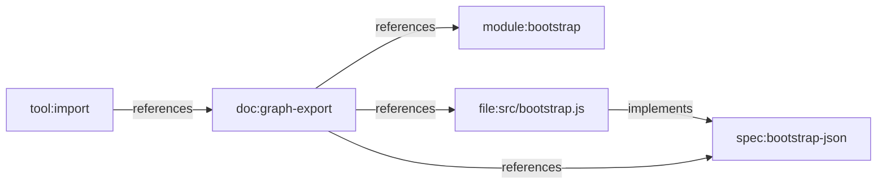

# Feature Profile: Import Export Interchange

Status: active feature profile

Related:

- [GRAPH_SCHEMA.md](../../../GRAPH_SCHEMA.md)
- [Git Mind Product Frame](../git-mind.md)

## IBM Design Thinking Frame

Sponsor user:

- A maintainer, agent, or tool integrating graph data with external workflows.

Job to be done:

- When repository meaning needs to move between tools, let me import and export
  graph state through stable, validated interchange formats.

Hill or lane:

- Hill 2: Queryable answers with receipts.
- Supporting lane: foundation.

Playback evidence:

- A graph exported from one repo state can be reviewed, validated, imported, and
  compared without losing important semantic data.

## User Stories

- As a maintainer, I can export graph data for review or archival.
- As an agent, I can import a proposed semantic map in dry-run mode before
  writing it.
- As a tool author, I can rely on schema-stable JSON/YAML.
- As a reviewer, I can round-trip export/import and detect drift.

## Requirements

### Functional

- Export must support YAML and JSON.
- Import must validate node IDs, edge types, confidence, and references.
- Dry-run import must validate without writes.
- Markdown frontmatter import must remain a supported bootstrap-adjacent path.
- Import/export must preserve supported node properties, edge properties,
  confidence, and rationale.

### Non-Functional

- Output order must be deterministic.
- Invalid imports must fail before partial writes.
- Schema drift must be intentional and documented.

## Graph Data Model Usage

Import/export is the interchange boundary for
[Graph Data Model](../graph-data-model.md). It must preserve node IDs, edge
types, assertion properties, and schema versions without inventing a different
portable model.

## Test Plan

Fixtures:

- `minimal-graph-yaml`
- `rich-properties-json`
- `markdown-frontmatter-docs`
- `invalid-imports`

Golden path:

- Export to YAML and JSON.
- Import dry-run validates without writing.
- Import writes expected graph.
- Export/import/export round-trip is stable for supported data.
- Markdown frontmatter imports nodes and edges.

Edge cases:

- Empty graph.
- Node properties with strings, numbers, booleans, and nulls.
- Duplicate nodes or edges in import.
- Unknown prefixes that warn but are allowed.
- Unsupported edge types.

Known failures:

- Invalid YAML/JSON fails with parse error.
- Invalid node IDs fail validation.
- Edge references to missing nodes follow documented policy.
- Confidence outside range fails.

Fuzz:

- Generate YAML/JSON with random valid graph records.
- Generate malformed graph records.
- Generate Markdown frontmatter variants.

Stress:

- Import/export 100k edges.
- Very large property payloads within and beyond policy.
- Many repeated imports to test idempotency.

Regression:

- Round-trip stability.
- No partial writes on failed imports.
- Frontmatter import remains idempotent.
- JSON metadata schema remains stable.

Golden artifacts:

- YAML and JSON export snapshots.
- Invalid import error snapshots.
- Markdown frontmatter fixture docs.

Playback:

- A user can move graph knowledge through reviewable files without losing trust
  in the graph contract.
