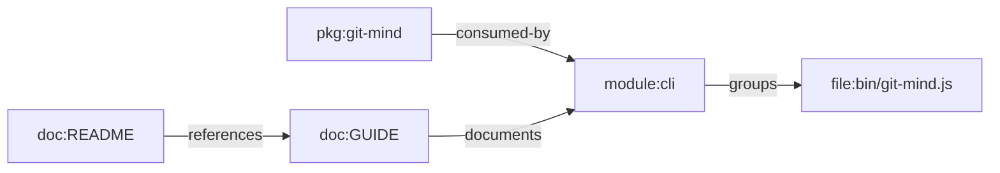

# Feature Profile: Packaging And Adoption

Status: supporting-lane profile

Related:

- [README.md](../../../README.md)
- [ROADMAP.md](../../../ROADMAP.md)
- issue [#286](https://github.com/flyingrobots/git-mind/issues/286)
- issue [#287](https://github.com/flyingrobots/git-mind/issues/287)
- issue [#288](https://github.com/flyingrobots/git-mind/issues/288)

## IBM Design Thinking Frame

Sponsor user:

- A new user or agent trying Git Mind in a real repository.

Job to be done:

- When I decide to try Git Mind, make installation, version discovery, and first
  run boring and trustworthy.

Lane:

- Supporting lane: packaging.

Playback evidence:

- A user can install Git Mind, run `git mind --help`, initialize a repo, and run
  the first Hill 1 command without reading source setup instructions.

## User Stories

- As a new user, I can install globally through npm.
- As an agent, I can check the version and command availability.
- As a maintainer, I can publish only intended package files.
- As a user, I can uninstall or install to `~/.local/bin` where supported.

## Requirements

### Functional

- Package metadata must expose the intended CLI binary.
- Published package must include only necessary runtime files.
- `--version` must be available.
- Install and uninstall scripts must avoid unsafe shell evaluation.
- Update checks, if added, must be non-blocking and privacy-conscious.

### Non-Functional

- First-run errors must be actionable.
- Packaging must not depend on local monorepo paths.
- Install docs must match shipped reality.

## Graph Data Model Usage

Packaging and adoption do not create new graph semantics, but they must make
[Graph Data Model](../graph-data-model.md) visible and usable. The install path
should expose commands that create and inspect canonical nodes and edges without
requiring users to learn the storage substrate first.

## Test Plan

Fixtures:

- `npm-pack-fixture`
- `global-install-smoke`
- `local-bin-install`
- `minimal-user-repo`

Golden path:

- `npm pack` contains expected files and excludes tests/fixtures where policy
  requires.
- Packed CLI runs `--help` and `--version`.
- Global install smoke initializes a temporary repo.
- Uninstall removes installed binary in supported mode.

Edge cases:

- Existing binary in target path.
- Missing Node version.
- Read-only install directory.
- Package run from packed tarball instead of checkout.

Known failures:

- Unsupported Node version fails with clear message.
- Unsafe install target fails.
- Missing runtime dependency fails in CI before publish.

Fuzz:

- Generate install paths with spaces and special characters.
- Generate package file allowlist comparisons.
- Generate semver strings for update-check parsing.

Stress:

- Repeated install/uninstall loop.
- Pack and smoke test under clean temp home.
- Cross-OS install matrix where CI supports it.

Regression:

- No local path dependency sneaks into package.
- No dependency downgrade.
- No unsafe eval in install scripts.
- Packed fixture harness still installs from lockfile.

Golden artifacts:

- `npm pack --dry-run` file manifest.
- Install smoke transcript.
- Version output snapshot.

Playback:

- A new user reaches first repo value without becoming a contributor to the
  build system.
