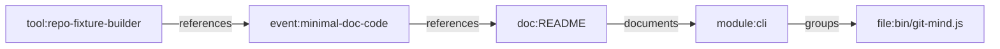

# Feature Profile: Repo Fixture Builder

Status: initial implementation available in `test/helpers/repo-fixture.js`

Related:

- [Repo Fixture Strategy](../repo-fixture-strategy.md)
- [ADR-0006](../../adr/ADR-0006.md)
- issue [#311](https://github.com/flyingrobots/git-mind/issues/311)
- issue [#316](https://github.com/flyingrobots/git-mind/issues/316)

## IBM Design Thinking Frame

Sponsor user:

- A Git Mind contributor or agent implementing repository-shaped behavior.

Job to be done:

- When I write tests for repository understanding, give me readable, reusable
  repo fixtures so tests describe product scenarios instead of shell plumbing.

Hill or lane:

- Supporting lane: foundation. It enables Hill 1 bootstrap tests.

Playback evidence:

- A bootstrap acceptance test can build a believable repo with docs, ADRs,
  commits, branches, and ambiguous references in a few readable lines.

## User Stories

- As a contributor, I can create a repo fixture without duplicating `mkdtemp`,
  `git init`, identity config, file writes, and commits.
- As a reviewer, I can read a test fixture setup and understand the repository
  story it represents.
- As an agent, I can compose base repos and overlays without relying on hidden
  local state.
- As a maintainer, I can migrate old one-off repo tests gradually.

## Requirements

### Functional

- Provide a fluent helper for temporary Git repo creation.
- Support file write, update, delete, chmod where needed, commit, branch,
  checkout, merge, tag, and ref helpers.
- Provide named base repos for Hill 1 scenarios.
- Provide overlays for ADR references, issue references, noisy docs, history,
  branching, and generated files.
- Return handles for repo root, file paths, commit SHAs, and expected semantic
  facts.
- Clean up temporary directories reliably.

### Non-Functional

- Fixture setup must be deterministic.
- Fixture names must describe the repository story.
- Archived binary snapshots must be exceptional and justified.
- Helpers must not hide meaningful semantic setup behind magic defaults.

## Graph Data Model Usage

The fixture builder creates repositories and expected graph shapes for
[Graph Data Model](../graph-data-model.md). It should make canonical nodes,
edges, confidence bands, and broken cases easy to express in tests.

## Test Plan

Fixtures:

- `fixture-builder-selftest`: a repo produced by the builder itself.
- `minimal-doc-code`: base repo for bootstrap.
- `branching-evolution`: base plus branch and merge overlay.
- `noisy-repo`: generated, vendored, ignored, and ambiguous inputs.

Golden path:

- Builder initializes a repo, writes files, commits, and returns stable SHAs.
- Base repo plus overlays produces expected file tree and commit graph.
- Cleanup removes temp repos after tests.

Edge cases:

- Empty commit attempts.
- File deletion followed by commit.
- Branch checkout with uncommitted changes must be rejected by helper policy.
- Merge conflicts can be intentionally created for failure-case fixtures.
- Symlinks and executable bits are supported or explicitly skipped per platform.

Known failures:

- Invalid overlay order fails with a clear error.
- Missing Git binary fails early.
- Invalid path escaping cannot write outside fixture root.

Fuzz:

- Generate random valid file paths and content.
- Generate overlay order permutations and assert declared dependencies are
  enforced.
- Generate commit messages with issue and PR references.

Stress:

- Build repos with 10k files.
- Build histories with 2k commits.
- Build repeated fixtures in parallel to detect temp path collisions.

Regression:

- No fixture writes outside temp root.
- No leaked temp directories after passing or failing tests.
- No reliance on global Git config.
- No reliance on host branch name or current working tree.

Golden artifacts:

- Expected `git log --graph --oneline` snapshots for key base repos.
- Expected file tree manifests.
- Expected semantic facts emitted by base repos and overlays.

Playback:

- A bootstrap test reads like: "given an ADR-linked service with noisy docs,
  when bootstrap runs, it infers these relationships." The setup is product
  language, not shell ceremony.
