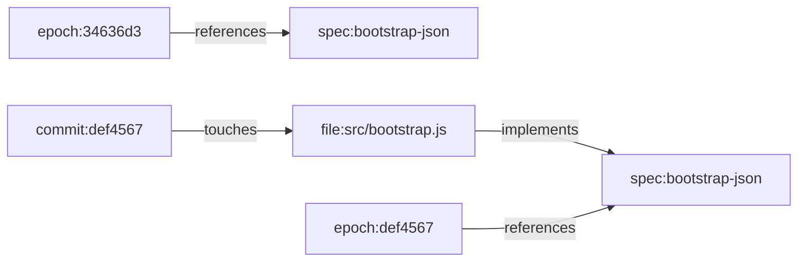

# Feature Profile: Time Travel And Semantic Diff

Status: active feature profile

Related:

- [Git Mind Product Frame](../git-mind.md)
- [ROADMAP.md](../../../ROADMAP.md)

## IBM Design Thinking Frame

Sponsor user:

- A maintainer or agent investigating how repository meaning changed.

Job to be done:

- When code and docs change over time, show me the semantic graph as of a ref
  and what changed between two refs.

Hill:

- Hill 2: Queryable answers with receipts.

Playback evidence:

- A user can compare two commits and see semantic additions, removals, and
  summaries that explain graph evolution.

## User Stories

- As a reviewer, I can see semantic changes in a PR range.
- As an agent, I can query graph state at `HEAD~10` before planning changes.
- As a maintainer, I can detect when relationships disappeared or new blockers
  appeared.

## Requirements

### Functional

- `--at <ref>` must materialize read commands at historical graph state.
- `git mind diff <a>..<b>` must compare graph snapshots.
- Diff output must include added/removed nodes, added/removed edges, and summary
  by prefix and edge type.
- Historical lookup must use recorded epoch metadata and safe nearest-ancestor
  fallback where designed.
- JSON output must be schema-stable.

### Non-Functional

- Historical reads must not mutate current graph state.
- Missing or malformed epoch data must degrade predictably.
- Diff order must be deterministic.

## Graph Data Model Usage

Time travel and semantic diff compare snapshots of
[Graph Data Model](../graph-data-model.md) across Git refs or WARP epochs. The
observable unit of change is a node, edge, or assertion property.

## Test Plan

Fixtures:

- `history-shaped`
- `branching-evolution`
- `malformed-epochs`
- `nearest-ancestor-history`

Golden path:

- `at HEAD~1 --json` returns older graph state.
- Diff reports added and removed nodes/edges.
- Prefix filtering scopes diff correctly.
- Merge history with nearest fallback yields deterministic output.

Edge cases:

- Both refs resolve to same graph tick.
- Ref with no direct epoch but ancestor epoch exists.
- Deleted branch ref.
- Non-linear history.
- Graph changes with identical working tree files.

Known failures:

- Invalid ref fails with typed error.
- Malformed epoch nodes are ignored or reported by policy.
- Missing graph state fails predictably.

Fuzz:

- Generate commit DAGs with random semantic changes.
- Generate malformed ref strings.
- Generate random graph snapshots and compare diff symmetry properties.

Stress:

- Large graph diff with 100k edges.
- Deep history with thousands of epochs.
- Branch/merge-heavy repo.

Regression:

- Historical materialization does not leak later edges.
- Diff excludes system nodes where specified.
- Prefix filters do not include edges with removed endpoints.

Golden artifacts:

- Diff JSON snapshots.
- Historical graph export snapshots.
- Commit graph diagrams for branch fixtures.

Playback:

- A reviewer can explain what repository meaning changed in a PR without
  manually comparing graph exports.
