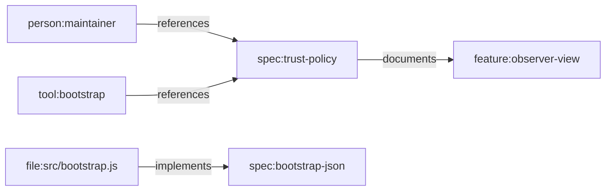

# Feature Profile: Trust And Observer Contexts

Status: active and evolving profile

Related:

- [CLI Contracts](../../contracts/CLI_CONTRACTS.md)
- [Git Mind Product Frame](../git-mind.md)

## IBM Design Thinking Frame

Sponsor user:

- A maintainer, reviewer, or agent that needs scoped or policy-filtered graph
  reads.

Job to be done:

- When I inspect repository meaning, let me constrain what I see by time,
  observer profile, or trust policy.

Hills:

- Hill 2: Queryable answers with receipts.
- Hill 3: Living map with low manual upkeep.

Playback evidence:

- Read commands can show graph state under a named observer or trust policy and
  explain the context used.

## User Stories

- As a reviewer, I can inspect only task-related graph state.
- As an agent, I can ask for approved-only facts when planning a change.
- As a maintainer, I can compare open vs restricted trust views.

## Requirements

### Functional

- Read commands must accept context flags consistently where supported.
- Observer surfaces must expose safe read APIs.
- Trust policies must be explicit and documented.
- JSON output should include context metadata.
- Missing observer support must fail with informative errors.

### Non-Functional

- Context filtering must not mutate graph state.
- Trust behavior must be deterministic.
- Unsupported context combinations must fail predictably.

## Graph Data Model Usage

Trust and observer contexts scope reads and writes over
[Graph Data Model](../graph-data-model.md). Observer metadata should explain
which person, tool, or policy produced or filtered an assertion.

## Test Plan

Fixtures:

- `observer-task-map`
- `approved-and-unreviewed-map`
- `mixed-confidence-map`
- `historical-context-map`

Golden path:

- Observer filters nodes, edges, and properties as configured.
- Approved-only trust policy excludes unreviewed inferred edges.
- Context metadata appears in JSON output.
- Time-travel and observer combinations behave as documented.

Edge cases:

- Observer excludes an edge endpoint.
- Observer exposes a property subset.
- Trust policy removes all answers.
- Missing optional graph APIs on observer surfaces.

Known failures:

- Unknown observer fails with typed error.
- Unsupported trust policy fails.
- Context on unsupported command fails or is ignored only if documented.

Fuzz:

- Generate observer match patterns and property exposure lists.
- Generate mixed confidence/review states.
- Generate context flag ordering permutations.

Stress:

- Large graph filtered by observer.
- Many observer profiles.
- Repeated context reads under parallel command execution.

Regression:

- Observer compatibility wrapper does not require unsupported write APIs.
- Missing observer dispatch reports `git-warp surface missing observer()`.
- Trust filters do not leak hidden edges.

Golden artifacts:

- Context metadata JSON samples.
- Observer-filtered graph snapshots.
- Trust-policy answer snapshots.

Playback:

- A user can ask "what does the repo mean under this policy?" and understand
  both the answer and the context boundary.
