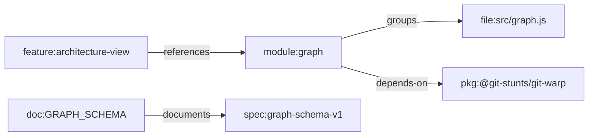

# Feature Profile: Views And Lenses

Status: active feature profile

Related:

- [Git Mind Product Frame](../git-mind.md)
- [ROADMAP.md](../../../ROADMAP.md)

## IBM Design Thinking Frame

Sponsor user:

- A maintainer or agent who needs a focused projection of repository meaning.

Job to be done:

- When the full semantic graph is too broad, show me the subset that answers my
  current workflow question.

Hill or lane:

- Hill 2: Queryable answers with receipts.
- Supporting lane: UX.

Playback evidence:

- A user can inspect architecture, backlog, roadmap, progress, and focused lens
  views without learning raw graph traversal first.

## User Stories

- As an architect, I can view module/package dependencies.
- As a lead, I can view tasks, blockers, and progress.
- As an agent, I can request JSON for a view and use schema-stable output.
- As a reviewer, I can chain lenses such as incomplete and frontier to find
  actionable work.

## Requirements

### Functional

- Built-in views must map to clear repository-understanding questions.
- Lenses must be composable and deterministic.
- View output must support JSON and human formats.
- Views must respect context flags such as `--at`, `--observer`, and trust
  policy where applicable.
- Custom view definitions must not compromise core graph invariants.

### Non-Functional

- View names must be stable.
- View outputs must be bounded and useful for humans.
- Lens composition must remain predictable under cycles and disconnected graphs.

## Graph Data Model Usage

Views and lenses are read-only projections over
[Graph Data Model](../graph-data-model.md). They select canonical node prefixes
and edge types without creating alternate semantics.

## Test Plan

Fixtures:

- `architecture-map`
- `roadmap-map`
- `blocked-backlog`
- `progress-status-map`
- `cyclic-dependencies`

Golden path:

- Architecture view shows module/pkg/crate nodes and dependency edges.
- Roadmap/backlog views show phase/task relationships.
- Progress view groups tasks/features by status.
- Lenses return expected incomplete, frontier, critical-path, blocked, and
  parallel subsets.

Edge cases:

- Empty graph.
- Graph with only non-view-relevant nodes.
- Cycles in blockers or dependencies.
- Missing status properties.
- Mixed manual and inferred edges.

Known failures:

- Unknown view fails predictably.
- Unknown lens fails predictably.
- Invalid lens chain syntax fails before graph traversal.

Fuzz:

- Generate DAGs, cyclic graphs, and disconnected graphs.
- Generate random status values and prefixes.
- Generate lens chain permutations.

Stress:

- 100k node graph with sparse dependencies.
- Deep critical path.
- Large blocker fan-in and fan-out.

Regression:

- Built-in views remain registered.
- Lens output order remains stable.
- View JSON contracts do not drift without schema update.

Golden artifacts:

- JSON view snapshots.
- Human output transcripts.
- Lens result fixtures for graph shapes.

Playback:

- A new user can inspect a repo through named views and answer concrete
  workflow questions without raw graph expertise.
