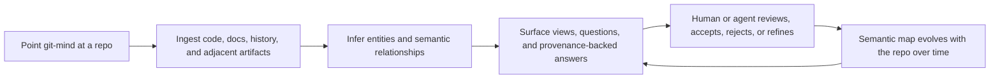
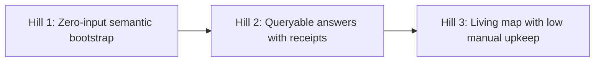

# Git Mind Product Frame

Status: canonical product frame

This document is the canonical IBM Design Thinking product frame for Git Mind.
Planning governance is defined in [ADR-0005](../adr/ADR-0005.md).
Delivery governance is defined in [ADR-0006](../adr/ADR-0006.md).

## Purpose

Reframe `git-mind` using an IBM Design Thinking style structure after the split that produced `think`.

This document exists to answer two questions:

1. What is left of `git-mind` now that the inward-facing cognitive capture thesis lives in `think`?
2. Is what remains a real product, or just leftover architecture?

The answer proposed here is:

`git-mind` is only worth continuing if it becomes a low-input, inference-first, provenance-backed semantic intelligence layer for Git repositories.

## Context

`think` now owns the personal cognition loop:

- raw personal capture
- re-entry
- reflection dialogue
- x-ray over a person's own evolving thought

That means `git-mind` no longer needs to carry personal cognition at all.

If `git-mind` continues, it should continue as a repository-facing product:

- repo artifacts
- semantic extraction
- cross-artifact association
- provenance and replay
- queryable engineering knowledge

## Problem Statement

Repository meaning is fragmented across:

- code
- docs
- ADRs
- tasks
- reviews
- pull requests
- issues
- commits
- CI and operational artifacts

Git tracks files and history well, but it does not directly tell you:

- which code implements which spec
- which ADR explains a given module
- which task, issue, or review drove a change
- which concepts recur across docs and code
- how those relationships changed over time

Today, people and agents reconstruct this from:

- filenames
- grep
- issue links
- commit messages
- tribal knowledge
- memory

That reconstruction is slow, lossy, and inconsistent.

`git-mind` exists to establish and surface semantic relationships between project artifacts, with provenance and history, directly from a Git repository and the artifacts around it.

## Sponsor User

Primary sponsor user:

- A technical lead, staff engineer, architect, or autonomous coding agent dropped into a repository who needs a trustworthy mental model of how the project's artifacts relate, with as little setup and manual curation as possible.

This user does not want:

- another hosted SaaS
- another hand-maintained project wiki
- another dashboard that drifts away from the repo
- another ontology exercise before the product becomes useful

They want:

- to point a tool at a repo and immediately get useful semantic structure
- to ask high-value questions and get provenance-backed answers
- to review and refine inferred associations when needed
- to trust that the map evolves with the repo instead of rotting beside it

## Jobs To Be Done

Primary job:

- When I point `git-mind` at a repository, help me quickly understand how its code, docs, decisions, tasks, reviews, and artifacts relate, and how those relationships changed over time.

Secondary jobs:

- Help me establish a useful semantic map with little to no manual input.
- Help me query repo meaning instead of reconstructing it from scratch every time.
- Help me trust the system's assertions by showing provenance, confidence, and historical receipts.
- Help me keep that semantic map current as the repository evolves, without turning maintenance into a second job.
- Help autonomous agents operate on repo knowledge through deterministic contracts instead of prompt folklore.

## Product Thesis

`git-mind` is a Git-native semantic inference and provenance layer for software repositories.

It should point at a repository and produce useful, reviewable, queryable knowledge about how code, specs, decisions, tasks, reviews, issues, and other project artifacts relate over time.

If it cannot do that with low setup and low ongoing manual labor, it is probably not a compelling product.

## What Git Mind Is

`git-mind` is:

- a repo-native semantic extraction and association engine
- a provenance-aware graph substrate for project artifacts
- a query surface over repository meaning and change over time
- a reviewable inference system for cross-artifact relationships
- a deterministic contract layer for humans and agents operating on repo knowledge

## What Git Mind Is Not

`git-mind` is not:

- a personal thought capture tool
- a reflection product
- a project wiki you manually maintain forever
- a generic PKM system
- a graph toy for enthusiasts
- a provenance tool in search of a use case
- a product that should require users to hand-author a full ontology before it becomes useful

## Product Doctrine

- Low-input semantic bootstrap is non-negotiable.
- Inference should precede manual modeling.
- Provenance must back every meaningful assertion.
- Confidence should be inspectable.
- Review should refine the map, not create the map from scratch.
- The graph is the substrate, not the main user mental model.
- Queryable value matters more than abstract graph elegance.
- `git-mind` should surface hidden project structure, not ask users to become librarians.

## Experience Principles

1. Favor extraction over manual entry.
2. Favor a useful first-pass map over a perfect ontology.
3. Favor provenance-backed confidence over opaque AI magic.
4. Favor reviewable suggestions over required curation.
5. Favor repo-native workflows over external knowledge silos.
6. Favor answers to real engineering questions over generic dashboard novelty.

## Conceptual Product Loop

## Hills

### Hill 1: Zero-Input Semantic Bootstrap

Who:

- A developer or agent entering an unfamiliar repository.

What:

- They can point `git-mind` at the repo and get an immediately useful semantic map extracted from code, docs, ADRs, issues, reviews, commits, and other available project artifacts, without having to model the graph by hand first.

Wow:

- "I pointed it at a repo and it actually gave me a map of what matters."

### Hill 2: Queryable Answers With Receipts

Who:

- A maintainer, reviewer, or coding agent trying to answer a concrete repository question.

What:

- They can ask things like what implements this spec, what decision explains this module, what changed semantically in this area, what is blocked, or what reviews and issues shaped this code path, and get provenance-backed answers with confidence and history.

Wow:

- Repository archaeology becomes a query with receipts instead of a manual investigation.

### Hill 3: Living Map With Low Manual Upkeep

Who:

- A team or agent workflow that wants the semantic map to remain useful as the repo changes.

What:

- `git-mind` continuously or periodically ingests new repo changes, updates inferred associations, and surfaces reviewable deltas so the map stays alive without becoming a hand-maintained wiki.

Wow:

- The repository's semantic map evolves alongside the repo instead of decaying beside it.

## Playback Questions

These questions should be used in design reviews and playbacks:

1. If I point `git-mind` at a repo today, does it produce useful structure without asking too much of me?
2. Does the first useful answer arrive before the user feels like they are doing data entry?
3. Can the system answer high-value engineering questions across code, docs, decisions, tasks, reviews, and issues?
4. Are assertions backed by provenance and confidence, or are they just vibes?
5. Are humans reviewing and refining inferred structure, or manually building the whole thing by hand?
6. Have we accidentally turned the product into a project wiki, dashboard, or ontology exercise?
7. Does the system get more useful as repo history accumulates?
8. Would an autonomous agent benefit from this as a contract boundary rather than just as prompt context?

## Repo Hygiene Findings

Repository hygiene work on 2026-03-24 exposed four important facts:

1. The GitHub issue backlog is real, but the GitHub milestone layer was not.
   - There were 31 open issues and none of them were assigned to a milestone.
   - There were also 10 open GitHub milestones, all of them 100% complete leftovers from earlier planning eras.
   - Those stale milestones were retired because they were no longer acting as a real control plane.

2. The open issue backlog clusters into a few real work lanes:
   - foundation and hardening
   - content and content UX
   - extension/runtime ergonomics
   - packaging and install polish
   - dogfooding and presentation polish

3. The repository still had multiple competing planning surfaces.
   - `README.md`, `ROADMAP.md`, `docs/VISION_NORTH_STAR.md`, and this design doc now describe the clarified product frame.
   - `GUIDE.md` still reflects an earlier manual graph-authoring story.
   - `TECH-PLAN.md`, `docs/RISK_REGISTER.md`, and `docs/RISK_REVIEW_CHECKLIST.md` still reflect the older milestone-driven platform and bridge roadmap.
   - Historical notes remain useful, but they should not compete with active product planning.

4. The backlog and the product strategy were being mixed together.
   - Open issues contain useful implementation work.
   - Old milestones were pretending to be the product strategy.
   - IBM Design Thinking works better here if strategy is expressed as Hills and evaluated through Playbacks, while GitHub issues remain the unit of execution.

## Recommended Operating Model

`git-mind` should no longer use GitHub milestones as its primary planning system.
That is now an accepted repository rule under [ADR-0005](../adr/ADR-0005.md), not just a temporary recommendation.

Recommended split:

- IBM Hills define the product outcomes that matter.
- Playbacks review whether recent work actually moved one of those Hills.
- GitHub issues track concrete work items.
- Docs capture the current product frame and playback conclusions.

In practice:

- Keep a small set of active Hills in `ROADMAP.md` and this design doc.
- Use GitHub issues for implementation and bug work.
- Triage issues by Hill or lane, not by faux-release milestone.
- Record playback outcomes in issue comments, PRs, or doc updates rather than reopening milestone theater.
- Treat historical milestone-era docs as references, not control planes.

This keeps the backlog honest:

- issues answer "what work exists?"
- hills answer "what outcome are we trying to create?"
- playbacks answer "did the recent work move us toward that outcome?"

## Boundary With Think

This boundary should remain explicit.

`think` owns:

- personal capture
- personal reflection
- brainstorm and re-entry
- x-ray over a person's evolving thought

`git-mind` owns:

- semantic extraction from repository artifacts
- repository-scoped relationship inference
- provenance and replay over project meaning
- queryable project knowledge
- reviewable semantic association across artifact types

If a proposed feature sounds like personal cognition tooling, it belongs in `think`, not here.

## Current Reading After The Split

What still feels real:

- queryable knowledge about how code, specs, decisions, tasks, reviews, and artifacts relate over time
- semantic relationship extraction across project artifacts
- provenance and replay over that semantic layer
- deterministic contracts for agent-facing repo knowledge

What should lose status:

- "version your thoughts" framing when it suggests personal cognition
- manual graph curation as the primary path to value
- authoring-heavy framing as the main product center
- platform ambition that gets ahead of immediate repo usefulness

## Non-Goals

Not the job of `git-mind`:

- personal capture
- personal reflection dialogue
- generic brainstorm tooling
- becoming a manually curated wiki first
- forcing users to build the semantic graph from scratch
- ontology complexity before product usefulness

Not the first priority from here:

- more abstract graph sophistication without better inference value
- broad extension-platform sprawl before the core repo-understanding hill lands
- dashboard-first product surfaces
- provenance features with no semantic question they help answer

## Risks

- The product becomes a juiced-up project wiki with extra steps.
- The system requires too much manual input before it becomes interesting.
- Inference quality is too weak or too opaque to trust.
- Provenance becomes a technical flex instead of a user-facing advantage.
- The product overlaps with other graph/provenance efforts without a clear boundary.
- Docs and roadmap keep telling different stories.

## Decision Rule

When a design tradeoff is unclear, prefer the option that improves zero- or low-input repo understanding and provenance-backed answers, even if it delays broader platform ambition.

## What We Found Out

After the split, `git-mind` still has a valid product thesis, but it is narrower and sharper than before.

It is not the inward-facing cognition system.

It is also probably not best framed as graph-backed authoring first.

The strongest remaining product shape is:

- automatic or low-input semantic association and surfacing for software repositories
- backed by provenance, history, and reviewable confidence

That is the part that still feels distinct, useful, and worth testing.

## Immediate Stabilize And Clarify Plan

1. Rewrite the root story so README, roadmap, and long-term vision all describe `git-mind` as an inference-first semantic repo intelligence product.
2. Remove or sharply narrow language that implies personal cognition is the center of the product.
3. Identify the top repository questions `git-mind` must answer on day one for an unfamiliar repo.
4. De-emphasize manual edge authoring as the primary product story; treat it as override, curation, or refinement.
5. Define the first zero-input bootstrap path: what artifacts are ingested, what entities are extracted, and what associations are inferred.
6. Retire stale planning machinery so the repo has one active operating model.
7. Decide whether the repo remains in active development once that sharpened hill is evaluated honestly.

## Recommended Next Hill

If `git-mind` continues as an active product line, the next hill should be:

- point at a repo and get an immediately useful semantic map with provenance-backed answers

That is the make-or-break test now.

If `git-mind` cannot create useful understanding from the repo with low setup, then the remaining product thesis is much weaker.

If it can, then there is still something real here.
