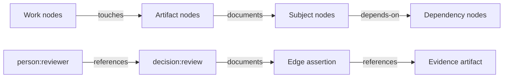
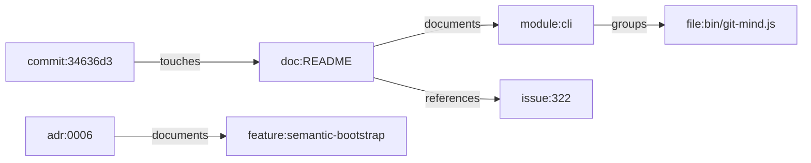
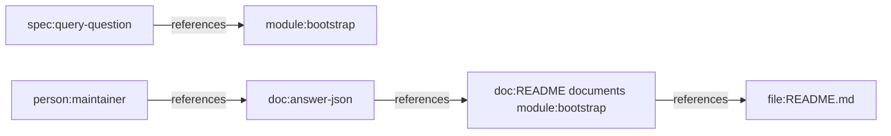
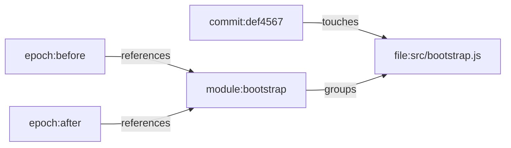

# Git Mind Graph Data Model

Status: draft canonical product model for issue #322

Related:

- [Graph Schema Specification](../../GRAPH_SCHEMA.md)
- [Git Mind Product Frame](./git-mind.md)
- [Hill 1 Semantic Bootstrap Spec](./h1-semantic-bootstrap.md)
- [Feature Profiles](./feature-profiles/README.md)

## IBM Design Thinking Frame

Sponsor user:

- A technical lead, staff engineer, architect, or autonomous coding agent
  entering an unfamiliar repository and needing a trustworthy semantic map
  quickly.

Job to be done:

- When Git Mind records repository meaning, use a small, stable graph vocabulary
  that can answer real engineering questions with receipts.

Hills:

- Hill 1: Zero-input semantic bootstrap.
- Hill 2: Queryable answers with receipts.
- Hill 3: Living map with low manual upkeep.

Playback evidence:

- A reviewer can inspect a bootstrap graph and understand why each node exists,
  what each edge means, which edges are inferred, which edges are reviewed, and
  which evidence supports query answers.

## Relationship To `GRAPH_SCHEMA.md`

`GRAPH_SCHEMA.md` is the current executable import and validation contract.
This document is the product-level graph model that feature design should use.

The split is intentional:

- `GRAPH_SCHEMA.md` defines what the current runtime accepts.
- this document defines the canonical vocabulary Git Mind should use for repo
  intelligence.
- if this document proposes a convention not yet enforced by code, the follow-up
  implementation must add tests before treating it as shipped behavior.

No feature should silently invent a second graph vocabulary. If the vocabulary
here is wrong, update this document and the affected feature profile together.

## Model Summary

Git Mind stores repository meaning as directed assertions between canonical
nodes.



The local Git repository is the graph scope. In v1, the local repository itself
does not need a regular `repo:` node. Cross-repo references use the existing
qualified ID form:

```text
repo:owner/name:prefix:identifier
```

Example:

```text
repo:flyingrobots/echo:module:wal
```

## Canonical Nodes

Node IDs use the existing `prefix:identifier` grammar. Identifiers should be
stable, human-readable, and derived from repo artifacts whenever possible.

### Artifact Nodes

| Prefix | Use | Example | Typical properties |
|--------|-----|---------|--------------------|
| `file:` | Repo file path | `file:src/graph.js` | `path`, `language`, `artifactKind`, `hash` |
| `doc:` | General documentation artifact | `doc:README` | `path`, `title`, `heading`, `artifactKind` |
| `adr:` | Architecture decision record | `adr:0006` | `path`, `title`, `status`, `date` |
| `spec:` | Product, API, schema, or behavior spec | `spec:bootstrap-json` | `path`, `title`, `schemaVersion` |
| `commit:` | Git commit discovered by history scan | `commit:34636d3` | `sha`, `author`, `date`, `summary` |
| `epoch:` | System temporal marker for historical views | `epoch:34636d3` | `ref`, `tick`, `createdAt` |

### Subject Nodes

| Prefix | Use | Example | Typical properties |
|--------|-----|---------|--------------------|
| `module:` | Internal module or subsystem | `module:bootstrap` | `name`, `path`, `package`, `owner` |
| `crate:` | Internal package when the repo uses crate language | `crate:git-mind-core` | `name`, `path`, `language` |
| `pkg:` | External package or dependency | `pkg:@git-stunts/git-warp` | `name`, `version`, `ecosystem` |
| `concept:` | Named idea that appears across artifacts | `concept:semantic-bootstrap` | `name`, `aliases` |
| `decision:` | Review or architecture decision event | `decision:bootstrap-contract` | `action`, `reviewer`, `timestamp` |

### Work Nodes

| Prefix | Use | Example | Typical properties |
|--------|-----|---------|--------------------|
| `issue:` | GitHub or tracker issue | `issue:322` | `number`, `title`, `state`, `url` |
| `pr:` | Pull request | `pr:323` | `number`, `title`, `state`, `url` |
| `task:` | Local work item or actionable unit | `task:h1-bootstrap-tests` | `title`, `status`, `owner` |
| `feature:` | Product feature grouping | `feature:query-receipts` | `title`, `hill`, `status` |
| `milestone:` | Historical or release grouping | `milestone:h1` | `title`, `status` |
| `phase:` | Phase alias used by legacy views | `phase:stabilize` | `title`, `status` |

### Actor And Tool Nodes

| Prefix | Use | Example | Typical properties |
|--------|-----|---------|--------------------|
| `person:` | Human actor or reviewer | `person:james` | `handle`, `displayName` |
| `tool:` | Tool, agent, service, or local integration | `tool:codex` | `name`, `version`, `capabilities` |
| `event:` | Named event in repo history | `event:bootstrap-playback` | `date`, `summary` |
| `metric:` | Measured value or health indicator | `metric:graph-density` | `name`, `unit`, `value` |

## Canonical Edges

Edges are directed. Direction matters because query receipts, views, and
review flows rely on it.

| Edge | Direction | Use | Example |
|------|-----------|-----|---------|
| `documents` | explainer -> subject | Artifact explains a subject | `doc:README -> module:cli` |
| `references` | source -> referenced | Explicit citation or mention | `doc:README -> issue:322` |
| `implements` | implementation -> spec or feature | Code or work realizes behavior | `file:src/bootstrap.js -> spec:bootstrap-json` |
| `touches` | change -> artifact | Commit, PR, or issue modifies or affects artifact | `commit:34636d3 -> file:README.md` |
| `groups` | parent -> child | Structural containment | `module:cli -> file:bin/git-mind.js` |
| `belongs-to` | member -> group | Planning membership | `task:h1-bootstrap-tests -> feature:bootstrap` |
| `depends-on` | dependent -> dependency | Requires dependency first | `module:query -> module:graph` |
| `blocks` | blocker -> blocked | Work cannot proceed until blocker changes | `issue:310 -> issue:304` |
| `consumed-by` | resource -> consumer | Dependency is consumed by a module | `pkg:@git-stunts/git-warp -> module:graph` |
| `augments` | extension -> base | Adds capability to subject | `tool:extension -> module:git-mind` |
| `relates-to` | source -> related | Low-specificity association | `concept:receipts -> concept:provenance` |

Use `relates-to` only when a stronger edge would be dishonest. If the evidence
can justify `documents`, `references`, `implements`, `groups`, or `touches`,
prefer the stronger type.

## Assertion Properties

The current runtime already uses these edge properties:

| Property | Required | Meaning |
|----------|----------|---------|
| `confidence` | yes | Finite number from `0.0` to `1.0` |
| `createdAt` | yes for local edge creation | ISO timestamp for creation |
| `rationale` | optional | Human-readable explanation |
| `reviewedAt` | optional | ISO timestamp for accepted or adjusted suggestion |

Feature work should converge on these additional conventions:

| Property | Meaning |
|----------|---------|
| `origin` | `manual`, `import`, `bootstrap`, `inference`, `review`, or `extension` |
| `detector` | Rule, parser, importer, or tool that produced the assertion |
| `evidence` | Stable evidence references such as paths, headings, line spans, commits, or URLs |
| `observer` | Trust or observer context used when the edge was read or written |
| `schemaVersion` | Machine contract version for structured edge metadata |

The exact shape of structured `evidence` should become a tested contract before
Hill 2 query receipts depend on it.

## Confidence Bands

| Band | Range | Product meaning |
|------|-------|-----------------|
| Verified | `1.0` | Human accepted or manually authored |
| High | `0.8` to `< 1.0` | Strong deterministic signal, not reviewed |
| Medium | `0.5` to `< 0.8` | Useful inference with visible evidence |
| Low | `0.0` to `< 0.5` | Review queue candidate |

Low-confidence edges should be useful enough to inspect, but they should not be
presented as settled facts.

## Core Patterns

### Bootstrap Map



### Query Receipt



### Review Decision


### Living Map Update



## Model Rules

1. Prefer artifact-derived IDs over invented IDs.
2. Prefer specific edge types over `relates-to`.
3. Never claim an inferred edge without confidence and rationale.
4. Inferred edges need evidence that a user or agent can inspect.
5. Review decisions are graph facts, not out-of-band UI state.
6. Historical views must preserve the graph as it was at the selected ref or
   epoch.
7. Extension-provided nodes and edges must declare their origin and should stay
   inside the same vocabulary unless a profile explicitly extends it.
8. Unknown prefixes are allowed by the v1 schema, but product features should
   not rely on unknown prefixes without updating this document and validators.

## Test Implications

Every feature that writes or reads graph meaning should test:

- node ID stability for representative artifacts
- edge direction and type selection
- confidence band assignment
- provenance or evidence availability for inferred edges
- deterministic ordering in machine output
- round trip through export/import when the feature exposes a contract
- historical or observer-scoped behavior when relevant

The feature-profile test plans define the concrete fixtures and golden artifacts
for those checks.
