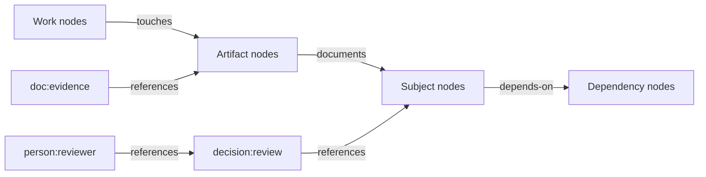
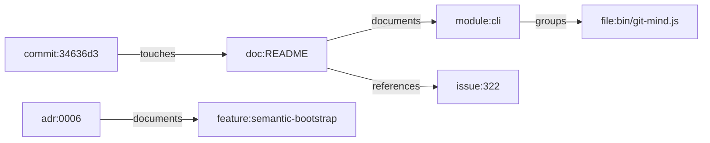
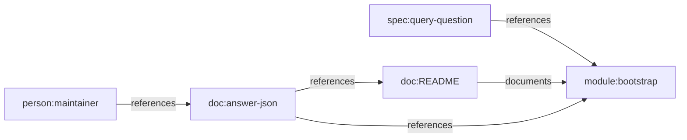
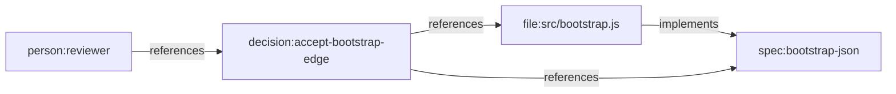
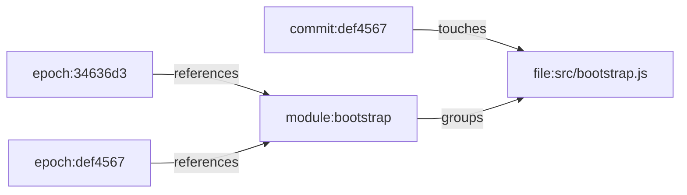

# Git Mind Graph Data Model

Status: draft canonical product model for issue #322

Related:

- [Graph Schema Specification](../../GRAPH_SCHEMA.md)
- [Git Mind Product Frame](./git-mind.md)
- [Hill 1 Semantic Bootstrap Spec](./h1-semantic-bootstrap.md)
- [Feature Profiles](./feature-profiles/README.md)

## IBM Design Thinking Frame

Sponsor user:

- A technical lead, staff engineer, architect, or autonomous coding agent
  entering an unfamiliar repository and needing a trustworthy semantic map
  quickly.

Job to be done:

- When Git Mind records repository meaning, use a small, stable graph vocabulary
  that can answer real engineering questions with receipts.

Hills:

- Hill 1: Zero-input semantic bootstrap.
- Hill 2: Queryable answers with receipts.
- Hill 3: Living map with low manual upkeep.

Playback evidence:

- A reviewer can inspect a bootstrap graph and understand why each node exists,
  what each edge means, which edges are inferred, which edges are reviewed, and
  which evidence supports query answers.

## Relationship To `GRAPH_SCHEMA.md`

`GRAPH_SCHEMA.md` is the current executable import and validation contract.
This document is the product-level graph model that feature design should use.

The split is intentional:

- `GRAPH_SCHEMA.md` defines what the current runtime accepts.
- this document defines the canonical vocabulary Git Mind should use for repo
  intelligence.
- if this document proposes a convention not yet enforced by code, the follow-up
  implementation must add tests before treating it as shipped behavior.

No feature should silently invent a second graph vocabulary. If the vocabulary
here is wrong, update this document and the affected feature profile together.

## Model Summary

Git Mind stores repository meaning as directed assertions between canonical
nodes.



The local Git repository is the graph scope. In v1, the local repository itself
does not need a regular `repo:` node. Cross-repo references use the existing
qualified ID form:

```text
repo:owner/name:prefix:identifier
```

Example:

```text
repo:flyingrobots/echo:module:wal
```

## Canonical Nodes

Node IDs use the existing `prefix:identifier` grammar. Identifiers should be
stable, human-readable, and derived from repo artifacts whenever possible.

### Artifact Nodes

- `file:` identifies a repo file path.
  Example: `file:src/graph.js`.
  Typical properties: `path`, `language`, `artifactKind`, `hash`.
- `doc:` identifies a general documentation artifact.
  Example: `doc:README`.
  Typical properties: `path`, `title`, `heading`, `artifactKind`.
- `adr:` identifies an architecture decision record.
  Example: `adr:0006`.
  Typical properties: `path`, `title`, `status`, `date`.
- `spec:` identifies a product, API, schema, or behavior spec.
  Example: `spec:bootstrap-json`.
  Typical properties: `path`, `title`, `schemaVersion`.

### Subject Nodes

- `module:` identifies an internal module or subsystem.
  Example: `module:bootstrap`.
  Typical properties: `name`, `path`, `package`, `owner`.
- `crate:` identifies an internal package when the repo uses crate language.
  Example: `crate:git-mind-core`.
  Typical properties: `name`, `path`, `language`.
- `pkg:` identifies an external package or dependency.
  Example: `pkg:@git-stunts/git-warp`.
  Typical properties: `name`, `version`, `ecosystem`.
- `concept:` identifies a named idea that appears across artifacts.
  Example: `concept:semantic-bootstrap`.
  Typical properties: `name`, `aliases`.
- `decision:` identifies a review or architecture decision event.
  Example: `decision:bootstrap-contract`.
  Typical properties: `action`, `reviewer`, `timestamp`.

### Work Nodes

- `issue:` identifies a GitHub or tracker issue.
  Example: `issue:322`.
  Typical properties: `number`, `title`, `state`, `url`.
- `pr:` identifies a pull request.
  Example: `pr:323`.
  Typical properties: `number`, `title`, `state`, `url`.
- `task:` identifies a local work item or actionable unit.
  Example: `task:h1-bootstrap-tests`.
  Typical properties: `title`, `status`, `owner`.
- `feature:` identifies a product feature grouping.
  Example: `feature:query-receipts`.
  Typical properties: `title`, `hill`, `status`.
- `milestone:` identifies a historical or release grouping.
  Example: `milestone:h1`.
  Typical properties: `title`, `status`.
- `phase:` identifies a phase alias used by legacy views.
  Example: `phase:stabilize`.
  Typical properties: `title`, `status`.

### Actor And Tool Nodes

- `person:` identifies a human actor or reviewer.
  Example: `person:james`.
  Typical properties: `handle`, `displayName`.
- `tool:` identifies a tool, agent, service, or local integration.
  Example: `tool:codex`.
  Typical properties: `name`, `version`, `capabilities`.
- `event:` identifies a named event in repo history.
  Example: `event:bootstrap-playback`.
  Typical properties: `date`, `summary`.
- `metric:` identifies a measured value or health indicator.
  Example: `metric:graph-density`.
  Typical properties: `name`, `unit`, `value`.

### System-Owned Nodes

The schema reserves some prefixes for Git Mind system writers:

- `commit:` identifies a Git commit discovered through repository history.
  Example: `commit:34636d3`.
  Typical properties: `sha`, `author`, `date`, `summary`.
- `epoch:` identifies a system temporal marker for historical views.
  Example: `epoch:34636d3`.
  Typical properties: `ref`, `tick`, `createdAt`.

Users and import files must not author `commit:` or `epoch:` nodes directly.
Bootstrap and history-aware features may create them only through Git Mind's
system-owned writers, with tests that also prove YAML/frontmatter import still
rejects those prefixes where the schema requires rejection.

## Canonical Edges

Edges are directed. Direction matters because query receipts, views, and
review flows rely on it.

- `documents`: explainer -> subject.
  Use when an artifact explains a subject.
  Example: `doc:README -> module:cli`.
- `references`: source -> referenced.
  Use for explicit citation, mention, or receipt evidence.
  Example: `doc:README -> issue:322`.
- `implements`: implementation -> spec or feature.
  Use when code or work realizes behavior.
  Example: `file:src/bootstrap.js -> spec:bootstrap-json`.
- `touches`: change -> artifact.
  Use when a commit, PR, or issue modifies or affects an artifact.
  Example: `commit:34636d3 -> file:README.md`.
- `groups`: parent -> child.
  Use for structural containment.
  Example: `module:cli -> file:bin/git-mind.js`.
- `belongs-to`: member -> group.
  Use for planning membership.
  Example: `task:h1-bootstrap-tests -> feature:bootstrap`.
- `depends-on`: dependent -> dependency.
  Use when one subject requires another first.
  Example: `module:query -> module:graph`.
- `blocks`: blocker -> blocked.
  Use when work cannot proceed until blocker changes.
  Example: `issue:310 -> issue:304`.
- `consumed-by`: resource -> consumer.
  Use when a dependency is consumed by a module.
  Example: `pkg:@git-stunts/git-warp -> module:graph`.
- `augments`: extension -> base.
  Use when one subject adds capability to another.
  Example: `tool:extension -> module:git-mind`.
- `relates-to`: source -> related.
  Use only for low-specificity associations.
  Example: `concept:receipts -> concept:provenance`.

Use `relates-to` only when a stronger edge would be dishonest. If the evidence
can justify `documents`, `references`, `implements`, `groups`, or `touches`,
prefer the stronger type.

## Assertion Identity

Git Mind does not currently model edges as first-class `edge:` nodes. The
canonical identity for an assertion is the edge tuple:

```text
(source, target, type)
```

Examples:

```text
(file:src/bootstrap.js, spec:bootstrap-json, implements)
(doc:README, issue:322, references)
```

Query receipts, import/export contracts, diagnostics, and review decisions
should cite this tuple key unless a future schema version deliberately adds
first-class assertion IDs. Do not invent synthetic graph nodes such as
`edge:abc123` or `assertion:xyz` without updating this model, the validators,
and the affected feature profiles.

## Assertion Properties

The current runtime already uses these edge properties:

| Property | Required | Meaning |
|----------|----------|---------|
| `confidence` | yes | Finite number from `0.0` to `1.0` |
| `createdAt` | yes for local edge creation | ISO timestamp for creation |
| `rationale` | optional | Human-readable explanation |
| `reviewedAt` | optional | ISO timestamp for accepted or adjusted suggestion |

Feature work should converge on these additional conventions:

| Property | Meaning |
|----------|---------|
| `origin` | `manual`, `import`, `bootstrap`, `inference`, `review`, or `extension` |
| `detector` | Rule, parser, importer, or tool that produced the assertion |
| `evidence` | Stable paths, headings, line spans, commits, or URLs |
| `observer` | Trust or observer context used when the edge was read or written |
| `schemaVersion` | Machine contract version for structured edge metadata |

The exact shape of structured `evidence` should become a tested contract before
Hill 2 query receipts depend on it.

## Confidence Bands

| Band | Range | Product meaning |
|------|-------|-----------------|
| Verified | `1.0` | Human accepted or manually authored |
| High | `0.8` to `< 1.0` | Strong deterministic signal, not reviewed |
| Medium | `0.5` to `< 0.8` | Useful inference with visible evidence |
| Low | `0.0` to `< 0.5` | Review queue candidate |

Low-confidence edges should be useful enough to inspect, but they should not be
presented as settled facts.

## Core Patterns

### Bootstrap Map



### Query Receipt



### Review Decision



### Living Map Update



## Model Rules

1. Prefer artifact-derived IDs over invented IDs.
2. Prefer specific edge types over `relates-to`.
3. Never claim an inferred edge without confidence and rationale.
4. Inferred edges need evidence that a user or agent can inspect.
5. Review decisions are graph facts, not out-of-band UI state.
6. Historical views must preserve the graph as it was at the selected ref or
   epoch.
7. Extension-provided nodes and edges must declare their origin and should stay
   inside the same vocabulary unless a profile explicitly extends it.
8. Unknown prefixes are allowed by the v1 schema, but product features should
   not rely on unknown prefixes without updating this document and validators.

## Test Implications

Every feature that writes or reads graph meaning should test:

- node ID stability for representative artifacts
- edge direction and type selection
- confidence band assignment
- provenance or evidence availability for inferred edges
- deterministic ordering in machine output
- round trip through export/import when the feature exposes a contract
- historical or observer-scoped behavior when relevant

The feature-profile test plans define the concrete fixtures and golden artifacts
for those checks.
